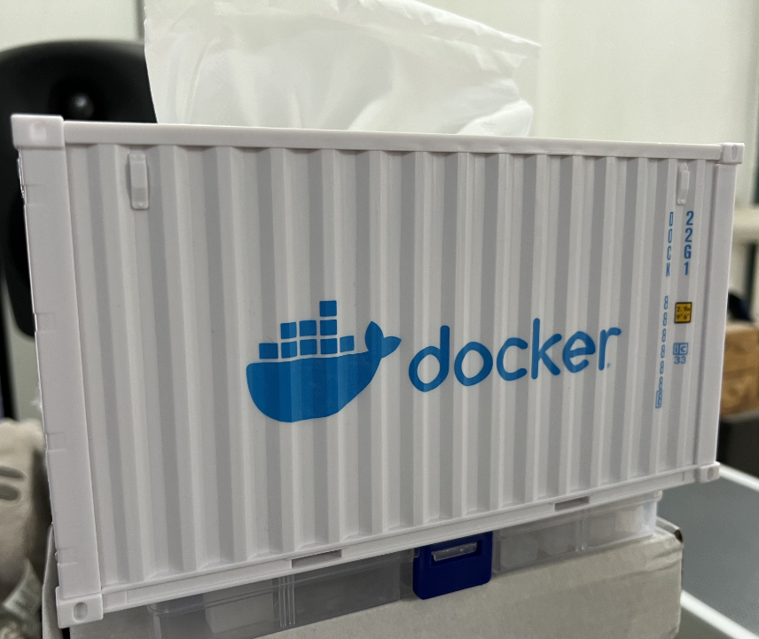

# 一切皆可容器化

欢迎回来。

在一个项目主要组件的开发工作基本完成后，我们会面临下一个问题是，如何有效快速地部署它。

## 为什么要容器化

对于构建成静态前端三大件（如我们使用的 Vite 创建的）项目来说，部署问题不难解决，只要一个 Web Server （例如 nginx 或是 Caddy）来提供对应的网页服务就可以，我们会在明天介绍更多更快更好的部署方式； Go 的话就更方便了，我们使用的 echo 本身就是一个 Web Server 框架，打包成的二进制文件在没有使用 CGO 的情况下也不会对其他部分产生依赖，因而稍微简单配置一下服务进程管理系统（如 systemd ）就可以。但如果是类似 Next.js 或是 Python 这种运行需要依赖后端环境的项目呢？

在无法预知目标系统环境状态的情况下，贸然假定它能正常运行是一件非常考虑欠佳的举措：我们永远无法知道目标系统上现有的东西会以怎样的形式和项目产生冲突。轻则是如欠升级的基础组件等，这样的话使用包管理工具执行一次升级或许就可以解决；重则是一些跨版本互不兼容的依赖环境，难以在不触动现有环境的情况下追加新的环境以运行新项目，遇到这种情况的时候传统的部署方式就会遇到困难了。另外还有可能出现的是某些在特定环境下才能复现的问题，没法向开发者提供完整的环境报告就很难定位到具体是哪里出了错，但并不是每一个部署的用户都有协助解决问题的能力。

在 PHP 时代里我们依靠的是同时将不同版本的 PHP 环境安装在不同路径下，从而让它们和平相处；从技术角度来讲，我们现在也可以对不同的环境依赖这么做，让它们运行在各自的舒适区；但这样复杂的配置会加大后续维护工作的难度，包括在未来可能发生的迁移工作中会带来很多历史遗留的麻烦问题。

另一个思路则是为每一个应用单独准备一个干净完整的部署环境。传统的技术里我们可以使用虚拟机来实现这样的工作，但有没有更轻量级一些的解决方案呢？

这就要提到我们今天的话题：容器。

## 什么是容器

容器一般意义上是指一个应用与它所需的运行环境的组合。对于没有环境依赖的、使用二进制可执行文件打包的应用来说，容器可以仅仅是它本身；对于一个 Next.js 项目来说，容器可以是 Node.js 运行环境、其在生产环境下所需要的依赖与其构建之后得到的针对生产环境优化的 JS 代码；对于一个 Python 项目来说，容器可以是 Python 环境、其所需的依赖与其的源代码。

但容器的概念也并不绝对，广义上的容器可以说是使用容器技术封装的一切东西。一些项目会将更多的东西打包进容器，例如 GitLab 会将整套运行环境打包进去，而像是 Docker-OSX 这种项目则更是利用容器实现了整套的 Hackintosh 。

为了避免概念上的混乱，我们这里就还是讲一般意义上用于封装单个应用程序的容器。

## 开始使用容器

我们以 Docker 这个容器解决方案为例，逐步开始了解容器相关的内容。

::: details 安装 Docker

Docker 官网提供了安装 Docker 的完整流程说明。针对图形界面环境他们提供了一个 GUI 工具 Docker Desktop 方便使用，而对于 Linux 服务器这种命令行环境则直接安装引擎即可。

特别地， Docker 提供了一个快速安装脚本可供 Linux 命令行环境使用，就像这样：

```sh
bash <(curl -L -s https://get.docker.com)
```

也有一些第三方提供了一些自称比 Docker Desktop 体验更好的图形化管理工具，如果您有兴趣的话，可以自行了解尝试。

:::

::: danger root 权限

如果您在 Linux 环境下运行今天讲的 Docker 内容，那么您可能需要 root 权限。这不是一个安全的做法。如果您担心可能会存在安全隐患，您可能需要创建一个虚拟机来完成今天的内容。

Docker 也提供了 rootless 的运行模式，但我暂时还没有尝试过它。未来我会进一步了解更多内容。

请**尽可能避免**在生产环境下使用 root 权限。

在 Windows 和 MacOS 环境下， Docker Desktop 会自行管理相关需要的权限。可以不用在意它。

:::

### 容器与镜像

如果您安装过操作系统，那么您一定知道镜像是指什么：用于解开得到目标操作系统实例的通用资源。

容器的镜像也是如此，在分发时我们会将目标应用打包成一个一个镜像，再在需要使用时创建出对应的具体的容器。

### 打包一个镜像

Docker 使用一种名为 Dockerfile 的流程声明来指引构建一个镜像。

Dockerfile 没有固定的流程要求，因而不同的人有不同的用法：有些项目可能会在外部构建出可执行文件之后，在 Docker 镜像的构建过程中直接下载它来实现封装。我则更习惯在 Dockerfile 里直接定义完整从源码构建项目的流程，以便尽可能减少不稳定的外部依赖。这样的写法一般分为两大阶段：构建阶段与封装阶段。

以我们在 Day 4 的课后挑战为例，如果我们要将它打包成一个镜像，我会这样编写 Dockerfile ：

```Dockerfile
FROM golang:alpine AS Builder

# 设置当前工作目录
WORKDIR /app

# 复制依赖声明文件
COPY go.mod .
COPY go.sum .

# 下载所需依赖
RUN go mod download

# 复制所有内容（包含项目代码）
COPY . .

# 构建可执行文件
RUN go build -o app .

FROM scratch AS Runner

WORKDIR /app

COPY --from=Builder /app/app /app/app

# 暴露默认端口
EXPOSE 1323/tcp

# 执行可执行文件
CMD ["/app/app"]
```

我们可以根据形如 `FROM ... AS ...` 的行，将这个 Dockerfile 分为两个阶段： `Builder` 与 `Runner` 。

阶段的名称并不重要（也并不必要），但一个语义化的名称往往能辅助理解与使用：顾名思义， Builder 就是构建阶段， Runner 就是执行阶段。每一个阶段的构建工作都会在独立的容器中进行，因而可以避免构建中的临时文件被错误地引入到生产阶段，造成不必要的资源浪费。

那么，各自的阶段都在做些什么呢？我们一行一行来看。

#### 构建阶段

1. 阶段的第一行以 `FROM golang:alpine AS Builder` 为起始，表示这一阶段使用了 `golang:alpine` 这个镜像作为基础镜像。 `golang` 是镜像在容器镜像注册库（registry）里的名称（就像项目的仓库名），而 `alpine` 是一个标签（就像项目里的提交）。对于 Docker 引擎来说，没有显式声明注册库名称的话，会默认使用 Docker Inc. 官方的注册库 `docker.io` ；没有显示指定组织或用户名的话，会默认使用 Docker Inc. 官方的组织 `library` 。`AS Builder` 是指给这个阶段提供一个别名，方便在下一个阶段中使用来自这个阶段的数据。

2. `WORKDIR` 一句是用于指引工作目录，即之后所有的操作都将在这里展开。使用根级目录的原因是这样更方便卷映射与管理，您可以根据自己的需要选择不同的目录，例如 /usr/bin 下的目录等。如果是对传统路径严格型应用的打包，还是更推荐使用与官方文档中直接部署相同的路径。

3. 接下来的两行 `COPY` 是为了复制文件。第一个参数是来源，没有特殊指定的话默认是构建时的外部目录；第二个参数是目的地：在这里的含义是将 `go.mod` 和 `go.sum` 两个文件从外部复制到容器的当前工作目录中。

4. `RUN` 表示运行指令，在这里我们使用的是 Linux 系统，所以是 shell 格式的指令。 `go mod download` 功能类似 `go get` ，但不同的是它并不会对 go.mod 产生变更，并且可以在根路径下没有代码的情况下也正常运行（通常见于一些多组件共存的仓库中）。在生产构建阶段，我更喜欢使用它。

5. 之后这一行 `COPY` 同样是复制文件，它的意思是将当前工作目录下的所有文件都复制到构建时的容器中。

6. 再之后的 `RUN` 运行的就是我们非常熟悉的 go build 构建指令了。 `-o` 参数指定输出的可执行文件名称，这里使用的是 `app`。

#### 执行阶段

1. 阶段的第一行以 `FROM scratch AS Runner` 为起始，标识这一阶段使用 `scratch` ——稍等， `scratch` 并不是一个传统意义上的镜像。这是一个特殊的标签，表示什么都没有，适合用在构建基础镜像的场合，或是像没有使用到 CGO 需求的项目中，打包成完全没有任何依赖的二进制执行文件的场合。您可以在 docker hub 里阅读更多关于 [scratch] 的说明。

2. `WORKDIR` 也还是一样，用于指引工作目录。

3. `COPY` 也同样是复制文件，但使用 `--from=Builder` 表示它是从 `Builder` 容器中，而不是外部作为复制文件的起始。

4. `EXPOSE` 行是声明需要暴露的端口。这一行并不必要，构建时没有暴露的端口也可以在部署时暴露；但对于使用交互式启动的用户来说，这样的声明可以提示用户这个端口会被用于通信，为用户提供方便。

5. `CMD` 行声明容器的默认启动指令。因为这里是调用一个可执行文件，并不传入任何其他参数，所以可以直接写单独的一个 `["/app/app"]`。

[scratch]: https://hub.docker.com/_/scratch/

#### 开始构建

当定义好 Dockerfile 之后，我们就可以来构建它了。在 Dockerfile 所在的项目根目录输入 `docker build .` 就可以构建镜像。

```
$ docker build .  // [!code focus] // [!code highlight]
[+] Building 21.0s (15/15) FINISHED                                                                                                                    docker:default
 => [internal] load build definition from Dockerfile                                                                                                             0.0s
 => => transferring dockerfile: 466B                                                                                                                             0.0s
 => [internal] load metadata for docker.io/library/golang:alpine                                                                                                 3.9s
 => [auth] library/golang:pull token for registry-1.docker.io                                                                                                    0.0s
 => [internal] load .dockerignore                                                                                                                                0.0s
 => => transferring context: 2B                                                                                                                                  0.0s
 => [builder 1/7] FROM docker.io/library/golang:alpine@sha256:cdc86d9f363e8786845bea2040312b4efa321b828acdeb26f393faa864d887b0                                   0.0s
 => [runner 1/2] WORKDIR /app                                                                                                                                    0.0s
 => [internal] load build context                                                                                                                                0.0s
 => => transferring context: 8.75kB                                                                                                                              0.0s
 => CACHED [builder 2/7] WORKDIR /app                                                                                                                            0.0s
 => CACHED [builder 3/7] COPY go.mod .                                                                                                                           0.0s
 => CACHED [builder 4/7] COPY go.sum .                                                                                                                           0.0s 
 => CACHED [builder 5/7] RUN go mod download                                                                                                                     0.0s 
 => [builder 6/7] COPY . .                                                                                                                                       0.1s 
 => [builder 7/7] RUN go build -o app .                                                                                                                         16.7s
 => CACHED [runner 2/2] COPY --from=Builder /app/app /app/app                                                                                                    0.0s
 => exporting to image                                                                                                                                           0.0s 
 => => exporting layers                                                                                                                                          0.0s 
 => => writing image sha256:23f85e1526f4bdf3d65f19e5afd3fec6f36eb6706a31dc180e4d445b868c8f54                                                                     0.0s 

What's Next?
  View a summary of image vulnerabilities and recommendations → docker scout quickview
```

但…构建是构建了，我们应该怎么使用它呢？不指定 tag 的话，我们就只能用 `23f8...8f54` 这一串长长的 SHA256 标签来使用。因而，出于方便的考虑，我们通常会在构建的时候为镜像指定一个标签。指定的方法也很简单，带上 `-t` 参数与需要指定的标签名称就可以，就像 `docker build -t day4-challenge .` 这样：

```
$ docker build -t day4-challenge . // [!code focus] // [!code highlight]
[+] Building 3.4s (15/15) FINISHED                                                                                                                     docker:default
 => [internal] load build definition from Dockerfile                                                                                                             0.0s
 => => transferring dockerfile: 466B                                                                                                                             0.0s 
 => [internal] load metadata for docker.io/library/golang:alpine                                                                                                 3.1s 
 => [auth] library/golang:pull token for registry-1.docker.io                                                                                                    0.0s 
 => [internal] load .dockerignore                                                                                                                                0.0s
 => => transferring context: 2B                                                                                                                                  0.0s 
 => [builder 1/7] FROM docker.io/library/golang:alpine@sha256:cdc86d9f363e8786845bea2040312b4efa321b828acdeb26f393faa864d887b0                                   0.0s 
 => [runner 1/2] WORKDIR /app                                                                                                                                    0.0s 
 => [internal] load build context                                                                                                                                0.0s 
 => => transferring context: 3.72kB                                                                                                                              0.0s 
 => CACHED [builder 2/7] WORKDIR /app                                                                                                                            0.0s 
 => CACHED [builder 3/7] COPY go.mod .                                                                                                                           0.0s 
 => CACHED [builder 4/7] COPY go.sum .                                                                                                                           0.0s 
 => CACHED [builder 5/7] RUN go mod download                                                                                                                     0.0s 
 => CACHED [builder 6/7] COPY . .                                                                                                                                0.0s 
 => CACHED [builder 7/7] RUN go build -o app .                                                                                                                   0.0s 
 => CACHED [runner 2/2] COPY --from=Builder /app/app /app/app                                                                                                    0.0s 
 => exporting to image                                                                                                                                           0.0s 
 => => exporting layers                                                                                                                                          0.0s 
 => => writing image sha256:23f85e1526f4bdf3d65f19e5afd3fec6f36eb6706a31dc180e4d445b868c8f54                                                                     0.0s 
 => => naming to docker.io/library/day4-challenge                                                                                                                0.0s  // [!code highlight]

What's Next?
  View a summary of image vulnerabilities and recommendations → docker scout quickview
```

可以看到我们的标签被自动扩展成了 `docker.io/library/day4-challenge` 这样的格式。这是为什么呢？

还记得构建阶段的第一行吗？ `golang` 镜像其实是省略了默认注册库、默认组织名的 `docker.io/library/golang` ，因而如果只是把标签写成 `day4-challenge` 的话它也会被默认扩展出官方注册库、官方组织名。

要避免被默认指定很简单，只需要显式指定我们需要的参数就可以。对于预期推送到 Docker Inc. 的官方注册库 `hub.docker.com` 上的镜像来说，我们可以省略注册库，使用形如 `candinya/day4-challenge` 这样的标签；而如果是想要推送到第三方的容器镜像库，例如 Github Registry 上的镜像来说，使用它对应的 `ghcr.io/candinya/day4-challenge` 这样就可以。

当然，因为它是标签，这里其实是省略掉了 `latest` 这个默认标签。我们想要一个不一样的标签 `foo` 的话，就可以像 `ghcr.io/candinya/day4-challenge:foo` 这样来手动来指定它：

```
$ docker build -t ghcr.io/candinya/day4-challenge:foo . // [!code focus] // [!code highlight]
[+] Building 3.5s (15/15) FINISHED                                                                                                                     docker:default
 => [internal] load build definition from Dockerfile                                                                                                             0.0s
 => => transferring dockerfile: 466B                                                                                                                             0.0s 
 => [internal] load metadata for docker.io/library/golang:alpine                                                                                                 3.3s 
 => [auth] library/golang:pull token for registry-1.docker.io                                                                                                    0.0s
 => [internal] load .dockerignore                                                                                                                                0.0s
 => => transferring context: 2B                                                                                                                                  0.0s 
 => [runner 1/2] WORKDIR /app                                                                                                                                    0.0s 
 => [internal] load build context                                                                                                                                0.0s 
 => => transferring context: 3.72kB                                                                                                                              0.0s 
 => [builder 1/7] FROM docker.io/library/golang:alpine@sha256:cdc86d9f363e8786845bea2040312b4efa321b828acdeb26f393faa864d887b0                                   0.0s 
 => CACHED [builder 2/7] WORKDIR /app                                                                                                                            0.0s 
 => CACHED [builder 3/7] COPY go.mod .                                                                                                                           0.0s 
 => CACHED [builder 4/7] COPY go.sum .                                                                                                                           0.0s 
 => CACHED [builder 5/7] RUN go mod download                                                                                                                     0.0s 
 => CACHED [builder 6/7] COPY . .                                                                                                                                0.0s 
 => CACHED [builder 7/7] RUN go build -o app .                                                                                                                   0.0s 
 => CACHED [runner 2/2] COPY --from=Builder /app/app /app/app                                                                                                    0.0s 
 => exporting to image                                                                                                                                           0.0s 
 => => exporting layers                                                                                                                                          0.0s 
 => => writing image sha256:23f85e1526f4bdf3d65f19e5afd3fec6f36eb6706a31dc180e4d445b868c8f54                                                                     0.0s 
 => => naming to ghcr.io/candinya/day4-challenge:foo                                                                                                             0.0s  // [!code highlight]

What's Next?
  View a summary of image vulnerabilities and recommendations → docker scout quickview
```

### 推送一个镜像

当我们打包完成一个镜像之后，就可以推送它。 Docker Inc. 的官方 hub 之前出现过*免费组织不友好的举动*（虽然又吃回去了，但毕竟前车之鉴，难保证以后会不会故技重施）

::: details 免费组织不友好的举动

如果您还没了解过这件事，以下是一份原始邮件的抄送（2023年3月15日）：

> **Important: Docker is sunsetting Free Team organizations**
>
> **Docker is sunsetting Free Team organizations**
>
> Free Team organizations are a legacy subscription tier that no longer exists. This tier included many of the same features, rates, and functionality as a paid Docker Team subscription.
>
> After reviewing the list of accounts that are members of legacy Free Team organizations, we’ve identified yours as potentially being one of them.
>
> If you own a legacy Free Team organization, access to paid features — including private repositories — will be suspended on April 14, 2023 (11:59 pm UTC). Upgrade your subscription before April 14, 2023 to continue accessing your organization.
>
> If you don’t upgrade to a paid subscription, Docker will retain your organization data for 30 days, after which it will be subject to deletion. During that time, you will maintain access to any images in your public repositories, though rate limitations will apply. At any point during the 30-day period, you can restore access to your organization account if you upgrade to a paid subscription. Visit our FAQ for more information.

但因为骂声太大，他们又把这个决定吃了回去（2023年3月25日）：

> **We’re no longer sunsetting Free Team organizations**
>
> On March 14, 2023, we emailed you about your Free Team subscription, outlining our intention to sunset that plan. After listening to the concerns of the community, we’ve decided to reverse course, and are no longer sunsetting the Free Team plan.
>
> If you’re currently on the Free Team plan, you no longer have to migrate to another plan by April 14. All customers who upgraded to a paid subscription will automatically receive a full refund for the transaction in the next 30 days, allowing them to use their new paid subscription for free for the duration of the term they purchased.
>
> We apologize for the alarm our decision caused. For more details, please visit our FAQ. 

:::

所以我更推荐使用一些第三方的镜像注册库，例如 GitHub 的 `ghcr.io` ，或是一些其他您喜欢的解决方案（例如自行部署的 GitLab 或是 Forgejo / Gitea 实例自带的注册库等）。

在任何注册库推送镜像前都需要先登录。我们以 `ghcr.io` 为例，可以这样登录：

```sh
docker login ghcr.io
```

在之后输入账号和密码（密码输入不会有回显，这是正常的），就可以成功登录了。

```
$ docker login ghcr.io // [!code focus] // [!code highlight]
Username: Candinya
Password:
Login Succeeded
```

::: tip 登录密码

出于安全因素考虑，一些注册库并不允许使用账号级别的密码进行登录认证，您需要创建一个访问令牌来使用。以 GitHub 为例，您需要创建一个 `Personal access tokens (classic)` ，并勾选 `write:packages` 权限才可以。

由于我们通常使用 CI 流水线自动化构建容器镜像（我们会在 Day 7 细讲这些），而一般的注册库与对应平台的流水线都有运行时的临时令牌功能集成，所以这个令牌不需要设置很长的有效时间，并且在配置完流水线之后就可以尽快销毁掉了。

:::

完成登录后，我们就可以将镜像推送到注册库了。以我们上一步构建的 `ghcr.io/candinya/day4-challenge:foo` 镜像为例，使用这个指令：

```sh
docker image push ghcr.io/candinya/day4-challenge:foo
```

或者也可以省略掉 image ，直接：

```sh
docker push ghcr.io/candinya/day4-challenge:foo
```

就可以看到推送成功了：

```
$ docker image push ghcr.io/candinya/day4-challenge:foo // [!code focus] // [!code highlight]
The push refers to repository [ghcr.io/candinya/day4-challenge]
e8998232c4a1: Pushed
b7fd93c3f57c: Pushed
foo: digest: sha256:9998b8a2a81440c2c841200f2bda697616c1a792bf92717f1f06162c88e1782b size: 733
```

我们再去对应注册库看一看（对 GitHub 来说可以从组织/个人页面的 `Packages` 选项页进入），是不是就能发现我们的镜像已经出现了呢。


Docker 的镜像推送规则与 npm 的发布规则不同，当推送同 tag 的镜像时，新的镜像会覆盖掉旧的，而不会推送失败。这也意味着我们总是可以将最新的生产环境镜像标记为 `latest` ——这也正是一种推荐的做法。

### 拉取一个镜像

您可能注意到了，我们刚刚推送的镜像是 `Private` 的。这意味着如果一个用户没有经过认证授权， ta 没法拉取这个镜像。这对于一些内部使用的镜像来说是好事，可以避免未经授权的访问；但对于需要公开推送可供其他人使用的镜像来说，需要将权限设置成 `Public` 以避免其他人拉取失败。

Docker 拉取镜像也非常简单，推送时候是 `push` ，拉取时候对应的就是 `pull` ，就像这样：

```sh
docker image pull ghcr.io/candinya/day4-challenge:foo
```

或者也可以省略掉 image ，直接：

```sh
docker pull ghcr.io/candinya/day4-challenge:foo
```

### 使用镜像创建容器

有了镜像之后，我们就可以使用镜像来创建容器。

#### 容器的生命周期

创建容器的指令很简单，就像这样：

```sh
docker run -p 1323:1323 ghcr.io/candinya/day4-challenge:foo
```

`-p 1323:1323` 参数表示将容器内部的端口映射到外部，如果是对于一些不需要接受入站请求的容器来说，就不需要这个参数。

可以看到它就像一个一般可执行程序一样运行起来了。使用 `Ctrl` + `C` 能向它发送结束信号，即像向一个一般可执行程序发送结束信号一样。

但它运行时会启动一个随机名称的容器，在结束运行后则会残留在系统中。为了避免残留，我们可以加上 `--rm` 参数，就像这样：

```sh
docker run --rm -p 1323:1323 ghcr.io/candinya/day4-challenge:foo
```

我们也可以使用 `--name 容器名称` 选项为它指定一个名称：

```sh
docker run --rm --name day4-challenge -p 1323:1323 ghcr.io/candinya/day4-challenge:foo
```

我们也可以使用 `-d` 参数让它在后台运行，就像这样：

```sh
docker run --rm --name day4-challenge -d -p 1323:1323 ghcr.io/candinya/day4-challenge:foo
```

可以看到命令行在输出了一串字符之后就返回了，但我们的容器依然在运行，请求也依然可以被处理。

输出的这一行是容器的 hash ，在我的环境下它是 `dc8f...4e14` 这样的一串。我们可以通过它来管理容器：例如我们希望停止容器的运行，可以这样（请替换成您环境下输出的这一串字符）：

```sh
docker stop dc8f701a000b215cb73f3526bda4597005cbb5beb3d60338128983113c474e14
```

当然了，由于我们为它提供了容器名称，所以我们也可以直接使用名称来管理它：

```sh
docker stop day4-challenge
```

因为我们指定了 `--rm` 参数，所以它在停止后会自动被销毁。如果不希望此种行为的话，可以去掉这个参数，而在需要销毁它的时候，先使用 `stop` 停止，再使用 `rm` 销毁就可以。就像这样：

- 启动
  ```sh
    docker run --name day4-challenge -d -p 1323:1323 ghcr.io/candinya/day4-challenge:foo
  ```
- 停止
  ```sh
    docker stop day4-challenge
  ```
- 销毁
  ```sh
    docker rm day4-challenge
  ```

如果不想销毁，而是想在停止之后再启动它的话，可以这样：

```sh
docker start day4-challenge
```

如果想要重启它的话，则是这样：

```sh
docker restart day4-challenge
```

#### 网络模式与端口映射

您可能注意到了，在上面的启动命令中我们指定了一个 `-p 1323:1323` 这样的参数。这个参数的意思是将容器内部的 `1323` 端口映射到容器外部（宿主机）的 `1323` 端口，这是因为我们的这个容器是一个需要接收入站请求的。

为什么需要指定这样的映射呢？对于 Docker 来说，其默认的容器网络是 `bridge` 模式，即对容器自己生成一个子网后，只将必要的端口规则映射到宿主机的网络。这样做的好处是可以避免一部分未授权端口的暴露，就像虚拟机的防火墙那样。如果希望容器运行在与宿主机对等的网络环境下、像直接执行一个可执行文件那样绑定端口监听的话，可以手动指定其为 `host` 模式。

一般对于容器来说，保持其内部的运行端口为默认值的居多，需要调整外部监听端口时直接改动外部端口就行。在 Dockerfile 中标注，但没有在容器创建时明确指明的端口也会被开启，但不会创建宿主机与容器之间的转发：即可以在容器网络内访问，但不能当作直接跑在宿主机上的程序一样被访问。如果想要外部端口只绑定到指定的 IP 和不同的端口上的话，可以使用 `127.0.0.1:2323` 这样的外部端口格式（整个写法就是 `-p 127.0.0.1:2323:1323` 这样），可以在保持容器不动的情况下灵活变更外部的端口映射。

端口映射可以有非常多高级而精细的用法，此处限于我自己主要常用的也就主要是一般直接映射，因而就不多展开赘述了，如果您有兴趣可以自行参阅 [Docker 文档中关于网络的描述]。

[Docker 文档中关于网络的描述]: https://docs.docker.com/network/

#### 持久化存储的卷映射

由于容器与宿主机的资源是隔离的，一些需要将数据保存出去，避免在重建时丢失的容器（例如数据库）就需要进行卷映射 (volume mapping) ，我们将这种行为称作持久化存储。

对于 docker run 来说，卷映射与端口映射一样简单直观：使用 `-v` 参数，跟上用冒号分隔的宿主机路径和容器内路径就可以。以 `postgres` 数据库镜像为例，将数据库存储映射到 `/custom/mount` 这个位置的参数为： `-v /custom/mount:/var/lib/postgresql/data` 。

在镜像构建时可以使用 `VOLUME` 在 Dockerfile 里声明需要被挂载为持久存储的位置，这样当使用对应的镜像构建时就会自动创建一个持久化存储卷。如果在创建容器时没有声明卷名称或是路径，它会被存放在宿主机的匿名卷空间里自动来管理。

需要注意的是，使用 docker run 命令时，如果要将指定路径挂载为卷，必须使用绝对路径格式（可以使用 `${PWD}` 配合相对路径构成绝对路径）。

同样地，卷映射也可以有非常多高级而精细的用法，此处限于我自己主要常用的也就主要是一般直接映射，因而就不多展开赘述了，如果您有兴趣可以自行参阅 [Docker 文档中关于卷映射的描述]。

[Docker 文档中关于卷映射的描述]: https://docs.docker.com/storage/volumes/

### 联合部署与统一管理

您可能已经发现了上面这种手动执行模式的一大问题：不方便。只是跑一两个容器还好，如果需要部署一个涉及各种网络组织结构和卷映射路径的复杂项目，手工一条条执行指令不但麻烦，而且容易出错，并且后期维护起来也会非常的头疼。有没有什么方便统一管理的办法呢？

幸好我们并不是第一个这样想的人，我们有 `docker compose` 这个强大的工具可以使用。它的思路很简单，即把所有需要的东西都先预先定义在一个文件里面，这样无论之后需要怎么处理，以这个部署文件为参考进行管理就可以。

::: details 安装 `docker compose`

对于古老版本的 Docker 来说，它并没有集成 docker compose 相关的功能，因而需要在安装完 Docker 运行环境之后，再单独下载一个 `docker-compose` 可执行文件来处理对应的操作需求。而在某个版本（具体哪个没有考证过）之后， compose 作为一个插件被引入了官方的安装支持，因而无需再执行二进制文件安装指令，直接就可以使用了。

与独立的可执行文件调用方法不同的是，因为可执行文件必须使用连续的文件名，因而是 `docker-compose ...` 这样的指令格式；但插件格式下则是作为 docker 指令的一个子指令，也就是 `docker compose ...` 这样，其他的操作则是完全一致的。

:::

默认的 compose 定义文件的文件名为 `docker-compose.yml` （或者扩展名为 yaml ）。以我们的 day4-challenge 为例，它的 compose 文件可以这样写：

```yaml
version: "3.9"
services:
  prime-calc:
    image: ghcr.io/candinya/day4-challenge:foo
    restart: unless-stopped
    ports:
      - "127.0.0.1:1323:1323"
```

具体的指令也与直接 docker 运行差不多，例如：

- 拉取所有镜像： `docker compose pull`
- 构建镜像（如果有服务指定了 `build` 字段的话）： `docker compose build`
- 创建并启动： `docker compose up -d` （ `-d` 参数表示启动后在后台运行）
- 停止： `docker compose stop`
- 启动： `docker compose start`
- 重启： `docker compose restart`
- 销毁： `docker compose down` （如果有创建卷映射的话，可以指定 `-v` 参数来销毁它们）

您可能会觉得它有点简陋——对于这样的小项目来说， compose 并不能发挥它的全部功效。那么，我们来展示一个我们可能会在 Day 7 里用到的*稍微有点*复杂的 compose 文件（可以先猜猜功能是什么？）：

{#挑战传送门}

```yaml
version: '3.9'
services:

  prometheus:
    image: prom/prometheus
    container_name: prometheus
    networks:
      - internal_network
      - external_network
    volumes:
      - ./config/prometheus:/etc/prometheus:ro
      - ./data/prometheus:/prometheus
    restart: always

  influxdb:
    image: influxdb:alpine
    container_name: influxdb
    networks:
      - internal_network
    volumes:
      - ./config/influxdb/config.yml:/etc/influxdb2/config.yml
      - ./data/influxdb:/var/lib/influxdb2
    restart: always

  grafana:
    depends_on:
      - grafana-db
    image: grafana/grafana
    container_name: grafana
    networks:
      - internal_network
      - external_network
    volumes:
      - ./config/grafana.ini:/etc/grafana/grafana.ini
    restart: always

  grafana-db:
    image: postgres:16-alpine
    container_name: grafana-db
    volumes:
      - ./data/db:/var/lib/postgresql/data
    environment:
      POSTGRES_USER: grafana
      POSTGRES_PASSWORD: password
      POSTGRES_DB: grafana
      POSTGRES_INITDB_ARGS: "--encoding='UTF8' --lc-collate='C' --lc-ctype='C'"
    networks:
      - internal_network
    restart: always
    healthcheck:
      test: ["CMD", "pg_isready", "-U", "grafana", "-d", "grafana"]
      interval: 30s
      timeout: 20s
      retries: 3

  caddy:
    image: caddy
    ports:
      - "443:443"
    networks:
      - internal_network
      - external_network
    volumes:
      - ./config/Caddyfile:/etc/caddy/Caddyfile
      - ./ssl:/ssl:ro
      - ./data/caddy/data:/data
      - ./data/caddy/config:/config
    restart: always

networks:
  internal_network:
    internal: true
  external_network:
```

不用害怕，我们一点一点来看它，就会发现里面有很多我们熟悉的老朋友。并且由于定义时的语义化特性，即便是不曾讲过的字段，相信也不难理解。就把分析这个 compose 文件作为课后挑战吧——先不要抱怨，即使真的不想认真看的话，我也会给出完整的解析，您可以在有兴趣的时候一点一点对照着理解。

### 水平扩展与资源限制

有时，我们会遇到一个容器的性能不足以支撑起逐渐增长的业务需求的场景。除了挑战让人头秃的多线程编程之外，有没有什么简单易行的性能提升方式呢？

多启动几个容器怎么样？如果我们的程序是无状态的（即运算与存储分离，程序本身不存储状态，而是通过外部的组件如 Redis 或 Postgres 来存储信息），那么我们可以通过简单的水平扩展来快速利用系统资源，提升业务性能。

通过 docker compose 中对应部分的定义，我们可以快速地实现这个需求。只需要在对应服务的声明部分加上这样的设置就可以：

```yaml
version: "3.9"
services:
  some-service:
    ...
    deploy:             // [!code ++]
      mode: replicated  // [!code ++]
      replicas: 8       // [!code ++]
```

这表示我们需要将 `some-service` 这个应用水平扩展 `8` 份——它们之间彼此独立，互不干扰地运行。

需要注意的是，这个数值并不是越大越好的。一般来说，我们不推荐它超过宿主机上的 CPU 线程数——假设一个应用在满载的时候会占满一个线程的话。

而为了避免单个容器占据过多的资源，我们也可以为容器指定资源限制相关的参数。例如：

```yaml
version: "3.9"
services:
  some-service:
    ...
    deploy:
      mode: replicated
      replicas: 8
      resources:        // [!code ++]
        limits:         // [!code ++]
          cpus: '0.60'  // [!code ++]
          memory: 128M  // [!code ++]
        reservations:   // [!code ++]
          cpus: '0.15'  // [!code ++]
          memory: 32M   // [!code ++]
```

如果这些容器都需要监听端口，我们可以开放多个连续的端口给这些容器使用。就像这样：

```yaml
version: "3.9"
services:
  some-service:
    ...
    ports:
      - "127.0.0.1:3000:3000"      // [!code --]
      - "127.0.0.1:3001-3008:3000" // [!code ++]
    deploy:
      mode: replicated
      replicas: 8
      resources:
        limits:
          cpus: '0.60'
          memory: 128M
        reservations:
          cpus: '0.15'
          memory: 32M
```

我们会在 Day 7 的内容中讲到负载均衡相关的内容。

唯一值得注意的是，在启动容器时这些端口会被随机分配给不同后缀的容器，并不意味着 3001 端口就一定对应着 1 号容器。虽然这样可能会让强迫症感到不开心，但它实际上不会影响任何功能——只要容器之间都是等价的就可以。

更多的 `deploy` 字段相关的用法可以参见 [Compose Deploy Specification] ，这里就不多展开了。

[Compose Deploy Specification]: https://docs.docker.com/compose/compose-file/deploy/

## 容器化成得与失

在对容器化有了一个简单的了解之后，我们来总结一下它的优势与劣势吧。

### 好处

容器化有不少好处，例如：

#### 方便管理

使用容器的一大好处是方便管理。不用刻意去记哪些服务是手动启动的、哪些服务是系统自动启动的，也不需要在 system log 里为了出错的条目拼命翻找，当不确定哪些容器正在运行、哪些容器已经停止的时候，最次也不过是 `docker ps -a` 一下的事，更不用说市面上有不少图形化的管理工具可以进一步优化相关流程。

在使用 docker 之前，我比较常用的 systemd 之外的服务进程管理工具是 pm2 。它也曾伴我经过了不少时光，但它的开源版本仅仅拥有非常精简的核心功能，稍微想要进阶一些就需要购买他们的商业服务 pm2+ ，这让我感到有些膈应。也有听说过使用 Supervisor 的，但我并没有了解太多。而在曾经使用~~拖库塔~~管理服务器的蛮荒年代，也使用过面板自带的一些管理功能，但随着个中原因最后发现还是手搓脚本和命令行来得方便（真香）。

而在开发的时候，对于不同的项目设置不同的依赖 compose 容器组，能快速在不同的数据环境中切换，这让开发工作变得更加迅速流畅。

#### 跨平台支持

容器的另一大好处就是可以无视平台支持，只考虑指令集就行。无论运行在 Windows 还是 Linux 上，只要是同样指令集（如 AMD64 ）的，那通通可以用同样的镜像，具体的平台间差异则由容器引擎自己来拉平。妈妈再也不怕我写的程序 Only works on my machine 啦。

包括对于一些依赖繁复或是构建流程复杂的项目来说也是如此。只要能提供一个有效的 Docker 容器，无论流程再怎么繁杂，一切都可以被快速稳定地复现出来（网络问题除外），那么终端用户就不需要和冗长的说明文档打架，直接启动一个容器——一切均已就绪。

::: tip 妙妙用法：新瓶装旧酒

还记得上面提到的那个 Docker-OSX 吗？既然 OSX 都可以被装进 Docker ，那些维护价格高昂但性能早已惨不忍睹的上古系统呢？

我印象里听说过这个用法（忘了是调侃还是个新闻），但想去搜却没搜到。仔细想了想好像也不太对：何必要折腾打包成 Docker 呢，直接把硬盘数据 dump 出来封个虚拟机是不是会更好一点？以及 Docker 不能解决指令集不兼容的问题，有些老系统没法迁移的原因是没有兼容指令集的新硬件了，于是只能花高价修修补补，也不敢运行在转译层上怕万一出点问题就完蛋。这也不是 Docker 能解决的。

或许是我记错了，总之我先在这里记一笔。当作个无稽之谈看看也好吧。

:::

#### 安全隔离

这就要提到我之前经历过的一次小事故了。起初是监控系统告警服务状态异常，打开网页看到服务在爆 500 ，一路排查发现是 Redis 容器在不停重启导致服务错误。再检查 Redis 日志，发现它在尝试往系统核心层写入数据（恶意代码），但因为权限不够所以触发了 panic ，在容器挂了之后再被引擎的重启策略拉起来，于是不停重复这个仰卧起坐的过程。最后发现是面板自带的防火墙参数没法应用到 Docker 网络层上，导致看似会被防火墙阻挡连接但其实并没有生效（配置完后也没有测试），因而还是庆幸使用了容器没有酿成更大的后果。

容器里的环境与宿主机是隔离的，只能通过一些给定的权限进行通讯；对于一些没必要开放的端口，还是应该尽可能把访问权限往小限制。如果使用的是传统部署方案的话，说不准系统就已经被攻破了。至于防火墙设置相关的问题，这还是应该在按流程走完后再仔细检查一遍，避免因为疏忽导致再有类似的事件发生。

以及，**别在晚上干精细活**。人累的时候脑子一糊涂做出来什么鬼东西就完全不知道了。

### 不足

那么古尔丹，代价是什么呢？

#### 高级权限

正如今天在开始使用容器时候给出的警告，默认情况下使用 `root` 权限运行 Docker 是具有风险的。倒不是说 Docker 有风险，而是说 `root` 权限本身就是一把双刃剑，用得好它可以非常方便地管理系统级别的资源，用不好一不小心 `rm -rf /` 就只能和宝贵的数据挥泪告别了。

当然， Docker 也提供了 rootless 的运行模式来方便在没有 root 权限的情况下使用。未来我会再继续深入研究这一块的内容的。

#### 虚拟化的限制

如果您使用独服（独立服务器）运行 Docker ，那么一般来说不会有什么问题；但如果您使用的是 VPS （虚拟服务器），那么您可能需要关注一下提供商使用的虚拟化解决方案是什么。如今主流的提供商均使用 KVM 作为底层虚拟化解决方案，这种方案没有问题，它能运行 Docker ；但一些古老服务商可能还会使用基于 OpenVZ 6 的虚拟化解决方案，那么很抱歉—— Docker 暂时不支持在这些虚拟化方案上使用，最低支持 Docker 运行的虚拟化版本也得是 OpenVZ 7。

而我们喜欢的 ProxmoxVE 创建虚拟机（VM）时使用的虚拟化解决方案使用的正是 KVM ，所以不用担心，自由运行吧。至于 LXC 容器，您也能安装 Docker 并运行，但它的虚拟化不完整，缺少一些组件因而一些应用可能会报错。如果有可能的话，还是尽量使用它创建的 VM 比较好（虽然管理起来确实是不如 LXC 方便）。

::: tip 题外话

ProxmoxVE 也是一个非常好用的虚拟化解决方案，用它开出来 LXC 之后把应用直接跑在上面也是非常好的。

:::

#### 资源重复

您可能注意到了，每一个容器的环境都是相互独立的。这确保了它们不会互相干扰，但相对应的一些可以共用的部分也没法被很好地利用起来。

以数据库为例，很多服务其实都可以共享数据库，因而如果对每一个服务单独跑一个数据库容器的话，会造成不小的资源重复和性能浪费。在生产环境中，这种可以共用的部分尽可能还是脱离开容器环境单独部署，共享资源吧。

但如果不同应用对数据库的版本有要求的话，那就还是拆开部署好了。都很方便的。

#### 性能损失

我们知道，包的层数越多，那么性能损失越严重，这是无法避免的问题。 Docker 也是如此，虽然因它损失的性能比起带来的好处来说基本可以忽略不计，但它确确实实会带来性能损失（主要是网络处理的 I/O 方面）。

如果您有兴趣，或许可以参考这篇来自 IBM Research 的研究报告： [An Updated Performance Comparison of Virtual Machines and Linux Containers] 。虽然已经是十年前的报告，如今的日新月异的技术发展让相关的内容早已完全不同，但它依然可以作为一份较为权威的资料来参考，其中的测试方法也值得拿来做复现实验使用。

[An Updated Performance Comparison of Virtual Machines and Linux Containers]: https://dominoweb.draco.res.ibm.com/reports/rc25482.pdf

#### 基础组件更新时容器重启

这个其实是我个人的痛点。因为 Docker 算是一个类似虚拟化的层级，那么在更新它（尤其是它的底层运行环境）的时候势必会让运行在它上面的容器都不得不重启。这对于非业务关键型应用来说倒是还好，重启了也就重启了；对于生产环境的一些业务关键型应用（尤其是有些启动还贼慢的东西），这个只能用噩梦的来形容。

要么在夜深人静的时候悄悄更新一把，希望没人发现（并且千万别更新爆炸！半夜真的很不适合干活），要么就只能早早贴出更新公告，期望着用户不要生气，然后期望着能正常更新完千万别出什么幺蛾子吧。

（买包乖乖放机箱上不知道会不会有用）

## 大规模的容器化

如果您接触过现代化运维相关的概念，那么您一定不会对 `Kubernetes (k8s)` 感到陌生。这是一个大型的容器化应用管理系统，旨在为多地域、多节点的复杂部署环境提供一个高可用性、高扩展性的解决方案。~~虽然现在不少提供商将它简单封装之后便一股脑把所有东西塞在一起其实有违其设计的初衷便是了。~~

简单来说就是，它能把一群服务器抽象成一个大型的容器系统，让运行在上面的容器能自由灵活地活动，允许一部分节点出现异常之后依然保持系统的正常运转。它非常适用于大型系统的部署，而对于小规模部署的场景来说它有些资源浪费——它的设计里为了容错会加入很多冗余机制，如果只是小规模部署的话，可能其本身系统占用的资源就会超过其上所有服务的总和。

那么，什么时候需要用到它呢？对于我自己部署的项目来说，目前的 docker compose 部署项目已经足够，加上一些存储和备份也足以应付数据冗余和灾备相关的需求。但在工作中，因为经常接触规模较大的项目，所以我们的业务是部署在 k8s 上的，我也需要不断接触并学习与 k8s 相关的一些概念。如果不知道从哪里入手的话，可以试试 `k3s` 这个轻量级的解决方案，它的使用和管理与完整形态的 k8s 很接近，但相对来说更加简单一些，不需要考虑控制面板与运算节点分离之类的复杂需求，完全交给它自己来管理就可以。在熟悉了 docker 相关的操作之后，可以把它当作是一种 DLC ，多了一些新的概念，也加入了不少强大的功能。

## 今日总结

灵活利用容器能让我们的开发与生产工作变得流畅而优雅。但这也意味着我们必须承担与之对应的一些损失与风险。**永远选择最适合自己的**，而不是最多人追捧的方案。

- 例如，如果您的项目非常需要把握每一丝一毫的性能（例如一些嵌入式开发），那么 docker 就是减分项，因为虚拟化会带来更多不必要的开销。
- 或者，比如您需要运行一大堆复杂的系统，并且随时可能面临着服务在不同设备间的迁移的需求，那么使用 compose 甚至 k8s 来组织项目，或许会是一个比在服务器上把东西放得到处都是、在迁移的时候会不自觉地忘记一些导致数据意外丢失（我经历过）更好的选择。

还有一件事，不要在深夜干活。

::: details 一个玩笑

Docker 可以封装任何东西，~~甚至是餐巾纸~~



:::

## 课后挑战

今天的课后挑战就是分析[那个巨大的 docker-compose.yml 文件](#挑战传送门) 。先不要偷看答案哦！

::: details 参考解析

我们可以从网络为入口来分析这个 docker compose 文件。

先看 networks 字段。可以看到这个项目使用了两个网络， `internal_network` 和 `external_network` ，其中 `internal_network` 限制为内部网络——意味着如果某个容器在这个网络中，那么它是没有外部网络访问权限的。

然后我们再来看 services 。一共有 `prometheus` `influxdb` `grafana` `grafana-db` `caddy` 这五个容器。

- `grafana` **depends_on** `grafana-db` ：这意味着只有在 grafana-db 启动后， grafana 才会启动。
- `influxdb` 和 `grafana-db` 只有 internal_network ：这意味着这两个容器没法直接与外界网络交互。
- `caddy` 容器暴露了 443 端口：这意味着它能接受来自外部的请求。

那么，具体到每个容器，它们都做了些什么呢？

- `prometheus` 容器映射了两个卷，分别是：

  | 宿主机              | 容器            | 只读模式           |
  | ------------------- | --------------- | ------------------ |
  | ./config/prometheus | /etc/prometheus | :white_check_mark: |
  | ./data/prometheus   | /prometheus     |                    |

- `influxdb` 容器也映射了两个卷：

  | 宿主机                       | 容器                      |
  | ---------------------------- | ------------------------- |
  | ./config/influxdb/config.yml | /etc/influxdb2/config.yml |
  | ./data/influxdb              | /var/lib/influxdb2        |

- `grafana` 容器映射了一个卷：

  | 宿主机               | 容器                     |
  | -------------------- | ------------------------ |
  | ./config/grafana.ini | /etc/grafana/grafana.ini |

- `grafana-db` 容器也映射了一个卷：

  | 宿主机    | 容器                     |
  | --------- | ------------------------ |
  | ./data/db | /var/lib/postgresql/data |

  同时，它还指定了这些环境变量：

  | 变量名称             | 变量值                                              |
  | -------------------- | --------------------------------------------------- |
  | POSTGRES_USER        | grafana                                             |
  | POSTGRES_PASSWORD    | password                                            |
  | POSTGRES_DB          | grafana                                             |
  | POSTGRES_INITDB_ARGS | "--encoding='UTF8' --lc-collate='C' --lc-ctype='C'" |

  同时，它还指定了一个每 `30s` 执行一次，超时时间为 `20s` ，最多重试 `3` 次的健康检查指令：

  ```sh
  pg_isready -U grafana -d grafana
  ```

- `caddy` 容器映射了好多卷：

  | 宿主机              | 容器                 | 只读模式           |
  | ------------------- | -------------------- | ------------------ |
  | ./config/Caddyfile  | /etc/caddy/Caddyfile |                    |
  | ./ssl               | /ssl                 | :white_check_mark: |
  | ./data/caddy/data   | /data                |                    |
  | ./data/caddy/config | /config              |                    |

并且，每一个容器的重启策略都是 `always` ，即在遇到错误或 docker 环境重启后，也都会自动重新启动。

那么，聪明的您猜到这个 docker compose 项目是做什么用的了吗？

不卖关子了，这个是我用来监测设备和容器运行状态使用的组合。

- prometheus 因为是主动发出采集请求，所以它需要外网访问权限； grafana 需要 SSO 登录所以也需要； caddy 是整个组合的流量入口，所以也需要外网权限。其他两个容器就不需要外网权限了。
- influxdb 是接收发送进来的请求数据，所以直接让 caddy 接收之后反向代理给它就可以。
- grafana 的数据存储在 grafana-db ，所以它需要依赖 grafana-db 启动之后才能启动。
- 映射的一大堆卷主要是配置和数据的存储，因为是 docker compose 项目，所以可以用相对路径的写法。
- grafana-db 容器的环境变量就是它的配置：它只需要在初始启动的时候使用配置初始化数据库就可以。健康检查是为了检查容器是否健康，而其他组件的健康检查很多我用的是一个外部的检查系统来执行。

至于整套系统的完整用法，我会在 Day 7 的对应部分再继续详细解释。今天就先这样吧。

对了，最后再补充一个细节：在 docker compose 里写卷映射的时候，它不知道宿主机上的卷应该是文件还是目录。如果需要是一个文件而不是目录，那么请在使用 `docker compose up -d` 启动前先手动创建好它，由 docker compose 来创建的话默认是会创建成一个目录的。

:::
