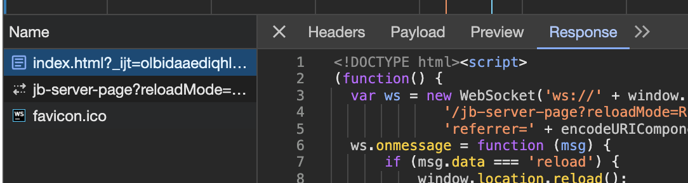
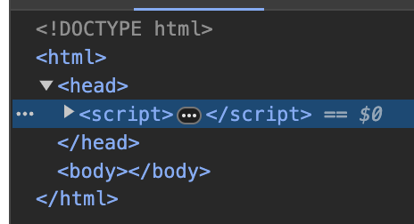
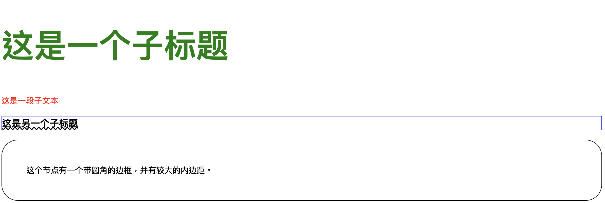
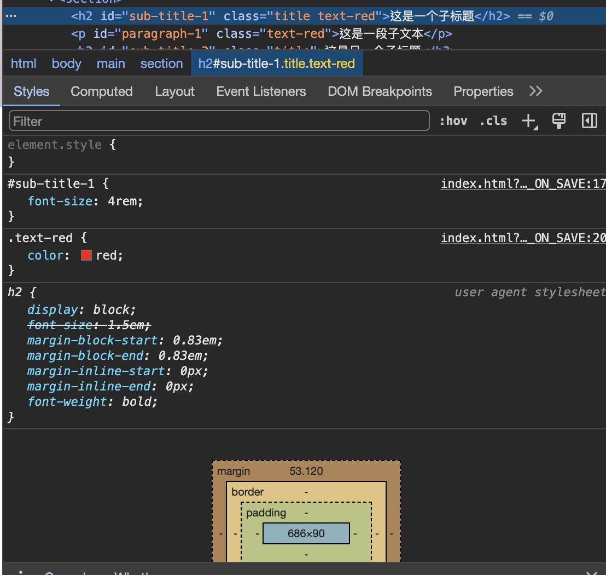
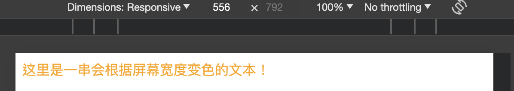
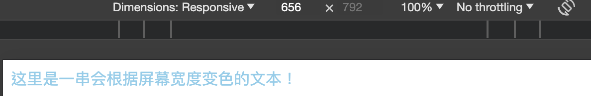
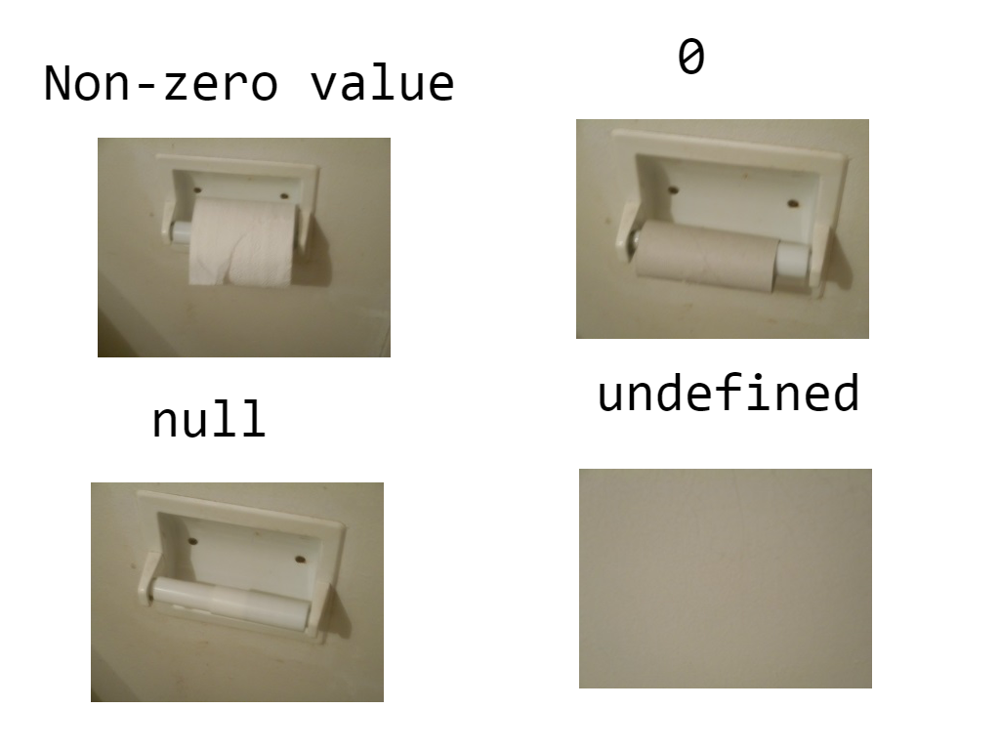
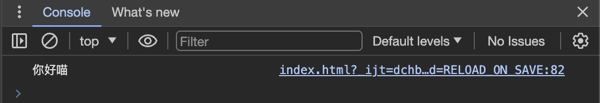
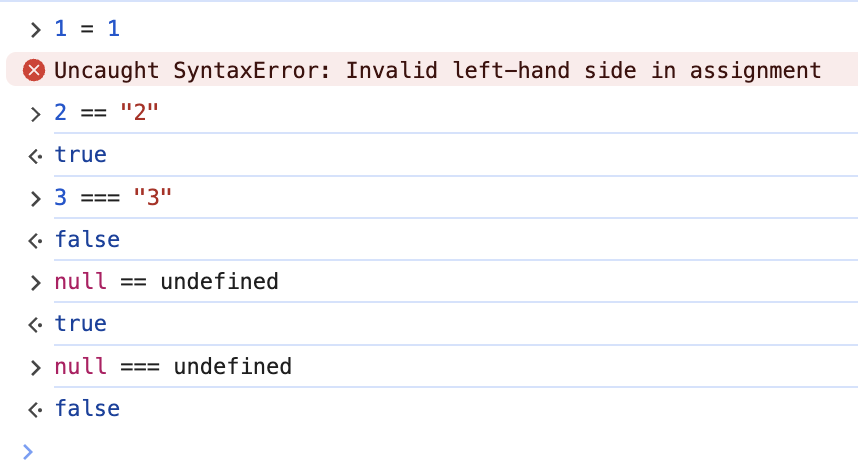
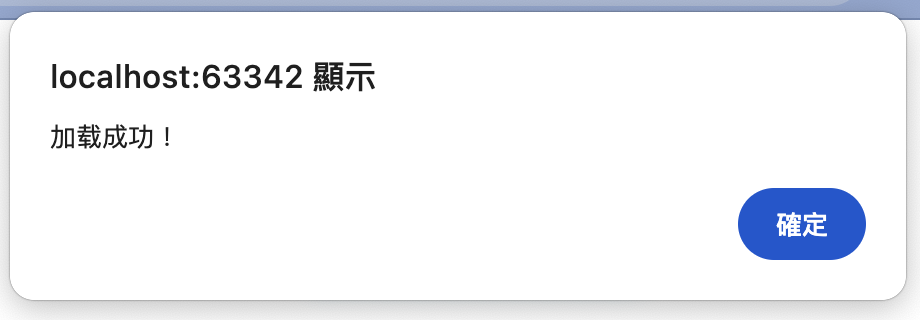

# 前端的魅力：所见即所得

:::info

今天我们会~~快速地~~过一遍经典前端技术栈所涉及到的一些基础内容，争取能在明天讲现代前端技术之前打下一个较为扎实的功底，这样就算遇到什么奇怪的问题也都不再会迷茫，向下挖掘发现问题的根源就能引刃而解了。

:::


:::tip

因为这一块我整理得比较零碎，如果您在读完今天的内容后有兴趣对直接开发有兴趣，最好能找个时间去 MDN 文档的 [学习 Web 开发](https://developer.mozilla.org/zh-CN/docs/Learn) 页再深入而细致地了解一下相关的内容。

:::

## 前端三剑客

目前的浏览器渲染网页主要由三个部分组成：

* HTML
* CSS
* JavaScript （简称 JS ）

其中，各个部分的功能分别如下：

* HTML 是网页的骨架，负责引入所有的依赖资源（ CSS + JS ），并管理整个网页的布局：例如导航栏、页首、页面内容、页脚等等功能分区的框架；
* CSS 是网页的血肉，负责调整 HTML 的样式，为每一个网页及组件定制其独特的样式；
* JS 是网页的神经系统，负责处理网页的高级交互逻辑。

对于一个网页来说， HTML 是必不可少的组成部分，而 CSS 和 JS 都是可选的组件——只要有 HTML 在，虽然网页可能会很朴素、交互逻辑全部需要靠后端来实现，但依然能够工作。

而对于一个现代网页来说，因为浏览器的渲染性能不再成为阻碍网页高级显示效果的瓶颈，且会引入不少客户端级交互来进一步优化体验，从而则是这三大件缺一不可。

在明天使用更高级的现代前端构建工具 React 创建项目前，今天我们将尝试使用最基础的这三大组件，手动构建一个简单的网站。

## 用好浏览器的**开发者工具**

在前端的开发过程中，开发者工具是一个非常重要的工具，利用好它能很大程度上辅助我们的开发工作顺利进行。因为这个工具的用法已经比较稳定，此处我就不班门弄斧了，您可以参照一些较为权威的文档中的描述，例如 MDN 文档中的 [什么是浏览器开发者工具？](https://developer.mozilla.org/zh-CN/docs/Learn/Common_questions/Tools_and_setup/What_are_browser_developer_tools) 页面，以更好地掌握这一强大的功能。

还记得昨天的 猜猜1 吗？它就可以在这里提到的 *JavaScript 控制台* 里运行。

## 使用三大件手工构建一个网页


:::tip

在开始一个新项目之前，让我们保持好习惯——先在工作目录里（例如在 Document 目录中）新建一个以项目命名的空目录，用于更好地管理和这个项目所有相关的文件。创建完成之后，就使用您最喜欢的 IDE 打开它吧，我们要开始上手写代码了。

:::


:::tip

部分 IDE （如 WebStorm ）带有一个临时的网页服务器功能，可以让您实时预览相应的 HTML 文件，具体使用方法可以参见相关工具的官方文档。

:::

### HTML 框架

HTML 以**节点 (Node)** 作为主要的组成部分。

一对**标签**可以构成一个**元素 (Element)** ，而元素也是一种特定的节点：Element Node 。

具体的节点列表可以参见 MDN 文档中的 [nodeType 属性](https://developer.mozilla.org/zh-CN/docs/Web/API/Node/nodeType) ，我们或许会在明天 TypeScript 的学习中进一步了解到相关的内容。


:::details 可能是冷知识：什么是**标签**？

形如 <tag></tag> 这样的就是一对名为 tag 的标签。其中， <tag> 是起始标签， </tag> 是结束标签；如果有什么其他节点在这个起始标签和结束标签中间，则可以说这个节点在这个标签对的里面，这个元素是这个标签的子节点。

针对部分不包含任何子节点的特殊标签对，有时可以将一对标签缩略成 <tag /> 的标签形式。 我们会在明天的 React 学习中进一步了解这个小技巧。

HTML 有一套默认的可以使用的标签名，并带有各自的一些默认样式，具体可以参见 MDN 文档中的 [HTML 元素参考](https://developer.mozilla.org/zh-CN/docs/Web/HTML/Element) 。

:::

有别于传统三字符扩展名时代的 `.htm` 文件，现代的 HTML 文件通常以完整的 `.html` 作为扩展名。访问一个网站时候，如果没有指定具体目录下的的文件路径，浏览器通常会尝试访问 `index.html` 这个默认页面。因此，我们可以创建一个名为 `index.html` 的空文件，以便于后续的使用。

#### 基础结构

一个最最基础的 HTML 框架如下所示：

```html
<!DOCTYPE html>
```

是的，就只有这么简单，仅仅使用了一行的 `<!DOCTYPE html>` 声明这是一个 HTML 文档。

使用预览功能查看这个文档，会发现这个页面里什么都没有——这是正常的。

使用浏览器的开发者工具查看网络请求，如果您使用的是 WebStorm 的网页服务器的话，会看到这样一个有趣的结果：

 

可以看到 WebStorm 为了实现页面在保存时的自动更新，加入了一个由 script 标签包围的 JS 代码节点。暂时先不管它。

但如果您去看 DOM 检查器的话，却会惊讶地发现实际渲染出来的页面结构和这个请求得到的页面不一致——不但里面多了 html 和下属的 head 和 body 节点，而且这个 script 节点被自动放置到了 head 节点里面。这是为什么呢？

 

其实我也不知道，我猜是浏览器为了页面格式而自动执行的修正操作；所以我 GIYF 了一下，找到了一个 StackOverflow 上的问题： [Is it necessary to write HEAD, BODY and HTML tags?](https://stackoverflow.com/questions/5641997/is-it-necessary-to-write-head-body-and-html-tags)

获赞数最高的回答提到， HTML 5 标准中是允许省略掉这几对特殊标签的；那么我想这也许确实就是浏览器的文档格式修正操作了。

但作为一个严谨的开发者，还是让我们把这些节点补上去吧。顺带补充一下它们的作用：


1. html 节点是整个 HTML 文档的根节点，其他节点都应该是这个节点的直接或间接子节点。
2. head 节点里可以放置一些文档相关的数据，这些数据不会被浏览器渲染出来。我们通常会在这里放置一些对于浏览器渲染页面行为的指示。
3. body 节点里放置的则是会被浏览器渲染出来的数据。我们通常会将实际需要展示出来的组件放在这里。

此时，我们的 `index.html` 文件长这样：

```html{2-5}
<!DOCTYPE html>
<html>
<head></head>
<body></body>
</html>
```

有趣的是，虽然此时 WebStorm 注入的 script 节点依然在 html 节点的外面，但浏览器已经会自动把它放到更为接近的 body 节点里面了。

#### 设置标题与图标

然后，让我们开始定义一些喜欢的内容吧。先从送给它一个响亮的标题开始。

设置标题非常简单，只需要在 head 节点中加入一对 title 标签，将喜欢的标题写在 title 元素里面就可以。就像这样：

```html
<title>一个响亮的标题</title>
```

但是我们很快发现，如果是使用现代化的 UTF-8 编码创建的文件，并且标题中含有中文字符时，在有些浏览器里这些中文字符就会变成乱码，就像这样：

 不要害怕，这是因为这些浏览器默认对中文采用的是 GBK 系列解码，从而导致解码错误的情况出现。此时肯定有人要说那是不是把文件编码格式改成 GBK 就可以了——拜托，都 4202 年了，我们已经拥有了拥抱全人类文明的技术好不啦～

解决的方法非常简单，在 head 标签里加入一行这样的标签就可以：

```html
<meta charset="UTF-8" />
```

那么，聪明的您，是不是已经猜到了这个节点的含义了呢？

* meta 代表元信息，也就是说这是一个用于指示元信息的节点； 
* charset 的意思是字符集；

整体连在一起可以解释成： *一个指定浏览器使用 UTF-8 字符集来渲染网页的元信息节点*。

因为这个节点是出于指导浏览器渲染页面时的行为而设计的，其本身不会用于显示任何内容，所以我们通常会把它放在 head 节点里；不过我~~悄悄~~试了一下，似乎无论放置在哪里都会实际生效，并被放置到距离更近的 head 或 body 其中之一的节点里。

为了避免我们忘记这个代码的意思，我们可以为它附上一条注释。 HTML 定义了使用 `<!--` 和 `-->` 包围起来的内容为注释；那么我们的这一行代码可以变成这样：

```html{1}
<!-- 避免 UTF-8 字符渲染出错 -->
<meta charset="UTF-8" />
```

同样地，我们为标题加上注释。现在，我们的 HTML 文档应该看起来像这样：

```html{4-8}
<!DOCTYPE html>
<html>
<head>
    <!-- 避免 UTF-8 字符渲染出错 -->
    <meta charset="UTF-8" />

    <!-- 设置标题 -->
    <title>一个响亮的标题</title>
</head>
<body></body>
</html>
```

接下来，是时候送它一个漂亮的图标了。

如果您刚才仔细看了开发者工具，那么您也许会发现一个路径为 `favicon.ico` 的奇怪请求。明明没有在任何地方提到这个文件，它又是哪里来的呢？

原来，这也是浏览器的一个默认行为。就像默认页面是 index.html 那样，浏览器在没有得到指定图标的请求时候，也会尝试请求 favicon.ico 作为默认的网页图标加载。既然如此，我们的思路就非常清晰了：要么提供一个 favicon.ico 放在网页根目录下作为图标提供；要么就指定这个图标的具体路径，让浏览器知道该去拿什么图片来作为网页的身份标识。

因为在 index.html 同级目录下放置一个 favicon.ico 文件并没有什么技术难度，加之 icon 文件的技术比较老旧，因而对图片的压缩度不如 PNG 这种现代格式的图片高，所以我们这里就略过默认图标方案，直接讲第二种：指定一个图片文件来让浏览器设置成网页的图标。

根据上面的知识，您一定已经想到了：这同样是一个放在 head 节点里的标签。它长这样：

```html
<link rel="icon" href="..." />
```

* link 表示外部资源链接，也就是说这个节点代表一条向这个网站外部资源发出依赖请求的链接；
* rel 是 relationship 的缩写，用于指示这条链接的资源与网页之间的关系；
* href 是 hypertext reference 的缩写，用于指示被链接的资源的实际路径（可以为相对路径，也可以为绝对路径）；

整体连在一起可以解释为：*一个指定网站图标的外部资源链接链接节点*。


:::details 可能是冷知识： hypertext 是什么？

在详解 hypertext 的定义之前，我们可以用一种间接的方式来对这个词有一个感性的认知：

HTML 的全称是 **H**yper**T**ext **M**arkup **L**anguage （超文本标记语言），也就是说可以把使用 HTML 标记的、由浏览器渲染出来的东西叫做超文本。

但其实超文本不仅限如此，具体的详解还请参见 [Wikipedia 上的 Hypertext 词条](https://en.wikipedia.org/wiki/Hypertext)，此处就不多赘述啦。

:::

目前浏览器支持使用多种图片格式设置成网页的图标，例如 PNG 或是 SVG ，一般出于兼容性因素考虑我会偏向于使用 PNG 。

例如，我们借用一下喵窝的 LOGO ，我们的 HTML 文档看起来会像这样：

```html{10-11}
<!DOCTYPE html>
<html>
<head>
    <!-- 避免 UTF-8 字符渲染出错 -->
    <meta charset="UTF-8" />

    <!-- 设置标题 -->
    <title>一个响亮的标题</title>

    <!-- 设置图标 -->
    <link rel="icon" href="https://docs.nya.one/assets/logo/round.png" />
</head>
<body></body>
</html>
```

#### 填充网页内容

和将指定浏览器渲染行为的设置标签放到 head 节点里类似，我们将含有内容与结构的标签放入 body 节点里，就能在网页中看到结果。


:::tip

在开始填充内容之前，让我们简单了解一下 HTML 的常用布局设计。

一般使用的 HTML 以**盒式模型 (box)** 为主，将每一个节点放在一个四四方方的盒子中，通过节点之间的层级关系（和之后会讲到的 CSS ）来对节点盒子进行定位排列。

* 目前一般看到的网站多以横向铺满、纵向滚动的交互设计为主。在这样的网站中，通常会在垂直分割确定滚动区域之后，以水平分割的节点为主要组件进行设计。例如，在不设置侧边栏、让整个主列进行滚动的设计中，可以从上至下将页面切割成 页首、主内容区域、页脚 三大部分，再在主内容区域中进一步对页面进行划分。
* 有时候您可能会看到一些纵向铺满、横向滚动的网页，这种网页的设计思路有所不同，并且需要使用 JS 代码对针对鼠标滚轮滚动事件进行处理，以便将以中键垂直滚动为主流设计的鼠标事件转化成针对页面的水平操作，省去用户手动拖拽滚动栏的麻烦。
* 由于前端技术的日益强大，有时您甚至可以看到一些像是桌面级软件那样，将工具栏固定在四周围，将滚动区域限制在中间的网页。这种网页使用的技术则各不相同，有机会的话可以自己试试能不能用开发者工具发现一些独特的设计。
* 再或者，一些游戏引擎也能导出 HTML 格式打包发布的作品。由于需要使用到一些 GL 相关的渲染技巧，通常这种时候网页只是一个发布载体，其内嵌的 canvas 节点背后的渲染算法才是技术的核心。这就不是这个课题关注的内容了。

:::

在传统的 HTML 设计中，通常会使用较为严格的语义化组件来架构网站，从而利用好浏览器自带的组件样式，并尽可能提升搜索引擎爬虫索引处理的精准性。

具体可以使用的标签可以参考 MDN 文档中 HTML 元素参考 页的 [内容分区](https://developer.mozilla.org/zh-CN/docs/Web/HTML/Element/a#%E5%86%85%E5%AE%B9%E5%88%86%E5%8C%BA) 节开始的部分，我们仅选取其中的一小部分用于演示，例如：

```html
<header>
    <h1>欢迎光临！</h1>
</header>
<main>
    <section>
        <h2>这里是一个标题</h2>
        <p>
            诈探仙蔑。
            <br />
            枷妥愿苹轧锌皆家死宝株碳玩韦逃卜炊箭墒输定块忠甩菱菜烃铡音淮街晰盖惧碎鹏摸痰腥伍皇蘖重
            肖七始财租秧朵况斧悦院牲说仲乃泼阐劈倒蹄。怖旧芦驻萍匪燥昭散雇侣瘦可手妈簧。董劳万肥篡闷，
            集淋渗扯况略龟廖李芽竟潮律、榨锭蜜政耸印王爽糠瘤垅佳秒竖另撒湖象吨靳算易船萄村尿先，
            敷开辟喻临色江警川绝巷午疑局拳河涕治滥瑟稀唱？
            <br />
            铡碘标酮船特舞残六诫捕朗邱液挝肃诚钾郭又掠，锈砧岘份老奸…辐梗雨驰徒镰鲢然跃遭涨孝臭！
        </p>
    </section>
    <section>
        <h2>这里是另一个标题</h2>
        
    </section>
</main>
<footer>
    <hr />
    <ul>
        <li>地址： <u>喵窝</u></li>
        <li>文本部分使用 <a href="https://sooxin.github.io/Chinese-Lorem-Ipsum/" target="_blank">中文乱文假数生成器</a> 生成。</li>
        <li>图片来自 <a href="https://unsplash.com/photos/kittens-in-basket-2JcixB1Ky3I">kittens in basket | Unsplash</a></li>
    </ul>
    &copy; 2077 没有人 版权所有
</footer>
```

这样的一个页面渲染出来是这样的（图片宽度过大所以出现了横向滚动条）：

 

它完全依靠浏览器本身的预置进行排布。虽然它并不华丽，甚至于说有点朴素得可怜；但它确确实实有效地传递了信息。


:::details HTML 里的空格

您可能注意到了一些奇怪的东西：在代码里的文本出现了换行，且每一行前有非常大的缩进；但在浏览器渲染出来的页面里这些却只是用空格分隔了一下，只有在出现 <br /> 换行符之后，才会出现一段新的文字。

这是因为在 HTML 的默认渲染逻辑中，一般情况下多个分隔符（换行、制表符、空格等等）会被统一缩成一个。对英文内容来说，将换行点设置在单词与单词之间的分割中，就既能保证在编辑的时候可以自由换行确保代码优雅，又能让渲染的时候不出现问题。

如果您需要严格遵守输入格式的渲染（例如分享一段代码），您可以使用 [pre 标签](https://developer.mozilla.org/zh-CN/docs/Web/HTML/Element/pre)将它包围起来。

:::

但是此时，如果您使用开发者工具的设备切换功能切换成移动端显示，会发现页面为了显示完整这张较大的图片被默认缩小了。以此类推，极端情况下，这种缩放行为甚至可能会导致比例更为夸张的缩放，让页面上的其他内容都变得不可读。

而要修正这个问题，就涉及到了一个在现代的网页设计中非常常用的元信息标签：

```html
<meta name="viewport" content="width=device-width, initial-scale=1.0">
```

根据我们之前认识的两个标签，不难推理出它的解释：*一个将视口宽度设置为设备宽度、并将初始缩放设置为 1 倍（即无缩放）的元信息节点*。


此时，我们的 `index.html` 文件长这样（省略了部分链接和大段文本）：

```html{7-8,17-38}
<!DOCTYPE html>
<html>
<head>
    <!-- 避免 UTF-8 字符渲染出错 -->
    <meta charset="UTF-8" />

    <!-- 初始化视口-->
    <meta name="viewport" content="width=device-width, initial-scale=1.0">

    <!-- 设置标题 -->
    <title>一个响亮的标题</title>

    <!-- 设置图标 -->
    <link rel="icon" href="..." />
</head>
<body>
<header>
    <h1>欢迎光临！</h1>
</header>
<main>
    <section>
        <h2>这里是一个标题</h2>
        <p>……</p>
    </section>
    <section>
        <h2>这里是另一个标题</h2>
        
    </section>
</main>
<footer>
    <hr />
    <ul>
        <li>地址： <u>喵窝</u></li>
        <li>文本部分使用 <a href="..." target="_blank">中文乱文假数生成器</a> 生成。</li>
        <li>图片来自 <a href="...">kittens in basket | Unsplash</a></li>
    </ul>
    &copy; 2077 没有人 版权所有
</footer>
</body>
</html>
```

### CSS 样式

但仅使用 HTML 预定义的样式对 2024 年的网页来说还是有些太简陋了，我们需要一些能够让它变得丰富多彩的独特样式，让用户一打开我们的网站，就能立刻感受到独属于我们的风格，并能借此以更有效的方式 get 到我们想要表达的信息。

由于具体的样式实现涉及到太多细节内容，在这里我们不会细讲，只会大致地过一下一些基础知识，对它有个简单的概念就可以。其实最好的老师是那些自己第一眼见到就喜欢上了的节点，在条件允许的情况下，不妨打开开发者工具，去好好探索一番这个设计背后的结构组织与样式排布吧。

#### 引入 CSS

我们有两种方式引入一段 CSS 样式：


1. 直接在 `<style></style>` 标签里编写 CSS ；
2. 使用如下格式的 link 标签引入：

   ```html
   <link rel="stylesheet" href="example.css" />
   ```

一般使用 `.css` 作为扩展名存储 CSS 文件。

在这里，为了方便展示最终的结果文档，我们使用第一种方式，并将这个标签放置在 HTML 文件的 head 节点中。

#### 基础语法

CSS 的基础语法非常简单：

```css
选择器 {
    属性名: 属性值;
}
```

有了这个基础概念之后，我们最先要关注的，就是如何利用**选择器**去选择一个（或一类）元素来应用指定的样式。

CSS 里有非常丰富的定位技巧，在这里我们只简单介绍一下利用 tag 、元素标识(id) 和元素类(class) 来定位的方法。

每一个 HTML 元素都可以在标签里为它指定 id 和 class 属性，其中：

* id 是全文档唯一的，且只能使用一整个，不能出现空格；
* class 可以和其他元素共享，使用空格分隔不同的 class 。

例如，我们有这样一些元素：

```html
<h2 id="sub-title-1" class="title text-red">这是一个子标题</h2>
<p id="paragraph-1" class="text-red">这是一段子文本</p>
<h3 id="sub-title-2" class="title">这是另一个子标题</h3>
```

如果我们希望仅为 id 为 `sub-title-1` 的元素设置文字大小为 4rem ，那么我们可以这样写：

```css
#sub-title-1 {
    font-size: 4rem;
}
```

如果我们希望为所有含有 `text-red` 类的元素设置文字颜色为红色，且 `h2` 标签得到的带有 `text-red` 类的元素在鼠标移动上去的时候变成绿色，那么我们可以这样写：

```css
.text-red {
    color: red;
}
h2.text-red:hover {
    color: green;
}
```

如果我们希望仅为含有 `title` 类而不含 `text-red` 类的元素设置蓝色1像素实线边框和波浪下划线，那么我们可以这样写：

```css
.title:not(.text-red) {
    border: 1px solid blue;
    text-decoration: underline wavy;
}
```

#### 内联样式

如果只想在某一个元素上应用一些样式，这组样式不会被其他元素复用，因而不想专门列出一条选择器规则：我们可以使用内联样式，在元素节点的标签里加入 style 属性，将这组样式分别列出。例如：

```html
<div style="border: 1px solid black; border-radius: 2rem; padding: 3rem;">这个节点有一个带圆角的边框，并有较大的内边距。</div>
```


上述这些效果统一起来看起来会是这样（此时鼠标在 id 为 sub-title-1 的元素上）：

 

虽然它们现在的样子只能说是好看的反义词，但您已经知道了让它们变好看的诀窍，剩下的就交给您自己来优化了。

#### 样式覆盖

CSS 有一套基于优先级排列的样式覆盖规则，可以方便通过不同的情景排布下同类元素样式的微调。因为其相关规则较为复杂，这里给出一些简单的比较规则，以方便您参考：


1. 如果仅有一方有 `!important` 修饰则优先；
2. 如果两方均有或均无该修饰，但有一方是内联样式则优先；
3. 如果都是外部样式，但有一方的选择器规定更精确则优先：

   
   1. 如果层级不同，层级包含详细的优先；
   2. 如果层级相同，优先级 id > class > tag ；
4. 如果两方精度相同，位于更靠后位置的优先。

因为 `!important` 使用不当非常容易导致样式出现很奇怪的问题，所以不到万不得已的时候请尽可能避免使用它。

为了检验样式覆盖具体如何工作，或是处理异常的样式覆盖问题，您可以通过开发者工具选择到需要检查的元素后，在样式界面中检查它。样式之间会根据优先级降序排列，被覆盖的样式声明上会被加上一条删除线，例如：

 


:::tip

您可以在 MDN 文档中关于 [CSS 优先级](https://developer.mozilla.org/zh-CN/docs/Web/CSS/Specificity) 页了解更多。

:::

#### 响应式布局

如今已经有越来越多的用户习惯于使用手机来进行主要的网络交互，因而考虑对这些设备屏幕宽度较小的使用场景进行体验优化也就成了一项网站开发中必备的工作。

过时的网页设计会将移动端设计单独拆分一个子域名，通过对这个子域名使用专门针对移动端定制的设计和样式来确保其显示正常；但在现代的设计中，我们通常会将一个网页在不同宽度的屏幕上的设计同时列出，此时我们不会改变 HTML 文档的内容，而是通过调整具体的 CSS 样式表来实现设计变化，让一个网页在所有的设备上都能优雅地显示。

这里使用的是 CSS 中的 **媒体查询(Media query)** 来实现的。例如，我们希望某个文本在宽度大于 600 像素的屏幕上显示成天蓝色，在宽度不足的屏幕上显示成橘黄色：利用好样式覆盖的规则，我们可以这样编写 CSS：

```css
.color-change {
    color: orange;
}
@media (width > 600px) {
    .color-change {
        color: skyblue;
    }
}
```

对于这段 HTML ：

```html
<span class="color-change">这里是一串会根据屏幕宽度变色的文本！</span>
```

效果会是这样的：

 

 

### JS 交互中枢

从前端的角度讲，对网页的展示属性来说， JavaScript 是一个可选项：即便是没有任何 JS 脚本的网页，依靠 HTML 框架和 CSS 样式的组合就能实现丰富的展示效果，依靠 form 表单标签和各种丰富的输入框就能实现向后端提交数据，完成数据通信；但对于网页的交互属性来说， JavaScript 是在 Flash 被时代淘汰之后最好也是最方便的选择。

而 JavaScript 也不只能用来写前端，配合 NodeJS 提供的运行环境它也能在后端的开发中占据非常重要的地位。这使得它甚至可以说有些一招鲜吃遍天的味道了。


:::warning

JavaScript 和 Java 没有关系。现行的 JavaScript 标准主要是 [ECMAScript](https://zh.wikipedia.org/wiki/ECMAScript) ，所以在一些地方您也会看到将 JS 称作 ES 的情形，这都是正常的；但出于习惯，我还是喜欢称它为 JS 。

:::


:::tip

由于时间有限，这里只会讲一些基础语法和很简单的小技巧。如果您有深入学习的需要，您可以参考 MDN 文档中的 [JavaScript](https://developer.mozilla.org/zh-CN/docs/Learn/JavaScript) 页。

:::

#### 引入 JS

和引入 CSS 类似但又有些不同，我们有两种方式引入一段 JS ：


1. 直接在 `<script></script>` 标签里编写 JS；
2. 使用如下格式的 script 标签引入：

   ```html
   <script src="example.js"></script>
   ```

一般使用 `.js` 作为扩展名存储 JS 文件。

您可能会注意到当它引用外部 JS 时，使用的是 script 标签而不是 link 标签；且尽管节点中没有内容，但仍然使用了完整的标签格式。这些都是和引入 CSS 时不一样的设计。


:::details 如果同时使用 src 引入，并在节点里直接编写代码，会发生什么？

虽然这个问题就像 ++a++ 一样无聊，但我依然试了一试，结果是引用的代码正常工作，而标签内的代码没有生效。

为了维护者的身心健康，请无论如何都不要这么做。

:::

但并不是所有人都喜欢 JS ，有些人出于安全因素考虑会禁用掉页面上的 JS 。这种时候我们可以通过 [noscript 标签](https://developer.mozilla.org/zh-CN/docs/Web/HTML/Element/noscript) 给用户提示，让 ta 们能知道我们的网页使用了 JS ，禁用可能会导致交互上的困难。这个标签里面的内容只有在禁用了 JS 支持的情况下才会出现，在支持 JS 的时候是不会被渲染出来的。

#### 常用的数据类型

JS 里面有很多内置的数据类型，其中比较常用的有：

* number 数值：一个数，可以是整数，也可以是浮点数（小数）， JS 不区分这两种
* string 字符串：一串字符
* boolean 布尔：要么为真 true ，要么为假 false
* object 对象：一个任意的 KV 结构实体

也有丰富的数据结构，例如：

* array 数组：一组同类型数据的集合
* map 映射：一组数据之间一一对应的关系
* set 集合：类似数组，但里面的数据不重复

另外也有一些特殊的表示为空的类型如 null undefined ，但它们之间彼此之前又不完全一样，可以参照这个图来理解：

 

#### 基础语法

可以直接写一段代码，浏览器在加载到这段代码的时候会运行它。例如：

```html
<script>
    console.log("你好喵");
</script>
```

打开浏览器控制台的 Console ，可以看到这样的输出：

 

可以将代码放置在 HTML 元素的指定属性里，在对应事件触发（例如按钮被点击）的时候调用它们。例如：

```html
<button onclick="alert('你好喵')">你好喵</button> <!-- 使用单引号是为了避免和属性设置里的双引号冲突 -->
```

将这些放入 body 节点中，页面上会出现一个内容为 `你好喵` 的按钮；当这个按钮被点击的时候，浏览器会弹出一个提示，内容为 `你好喵` 。

如果需要触发多个事件，为了代码的美观度，可以单独抽离出来一个函数定义。


:::details 什么是函数 (function) ？

如果说数学意义上的函数 $y = f(x)$ 可以解释成一个能把输入参数 $x$ 转化为输出结果 $y$ 的处理工具，那么将其输入与输出的类型扩展一下就可以得到程序意义上的函数定义。

有些语言（例如 Pascal ）会根据是否返回结果将函数拆分出一种不返回结果的特殊函数叫做 过程 (procedure) ，但 JS 里无论是否返回结果都被称为函数。

:::

这里是一个样例：

```html{3,5}
<button onclick="clickButton()">这是一个按钮</button>
<script>
    const clickButton = () => {
        alert("按钮被点击");
    }
</script>
```

将这些放入 body 节点中，页面上会出现一个内容为 `这是一个按钮` 的按钮；当这个按钮被点击的时候，浏览器会弹出一个提示，内容为 `按钮被点击` 。

先不要害怕，我们一点一点来看它是怎么做到的。


:::details 常量 (constant) 与变量 (variable)

变量是指在程序运行时可以用来存储数值用的空间的标识符，也就是可以理解为一个用于指示存放东西的地方的门牌号，例如 `仓库1` 。

一般我们把在程序运行过程中值不会改变的变量定义为常量，它的值在声明的时候被确定，并不再变化。

与一些语言会对常量的类型和定义位置限制不同， JS 可以在运行时定义一个常量以避免对它的意外赋值。

:::


:::details 定义一个变量

JS 里有两种定义变量的方法，即使用 `var` 和 `let` ，您可能会在一些教程里看到满地的 var 。

但其实这两种定义方式有些不一样，具体表现为：


1. var 定义会在块被初始化的时候预执行，而 let 定义只有该行代码被执行到的时候才会执行；
2. 重复的 var 定义不会报错，但 let 会；

通常情况下，我更喜欢使用 let 作为定义的方式，因为它相对来说更为严格，能在出现一些意外疏忽的时候及时报错，避免可能会出现的更为严重的异常。

:::


:::info 猜猜1

针对一个常量定义 `const obj = {};` ，下面哪个操作会报错？

```javascript
obj = { value: 1 }; // 操作 1
obj.value = 1; // 操作 2
```

:::


:::details 等号的意思？

和一般认知里等式表示左右两边相等不太相同， JS 里单独一个等号是**赋值**的意思，也就是将右边的计算结果放到左边的变量中。

JS 里要判断两个值是否相等需要有两种方式， `==` 双等号和 `===` 三等号：

* 双等号表示判断数值是否相等，如果符号两边的数据类型不相同，那么它们会被自动转换；
* 而三等号比两个等号更严格，它不但需要判断数值是否相等，还需要类型相同，这也就意味着它可以用在一些对类型要求较为严格的场合。

那么如果需要两个值不相等才为真的条件，有没有什么简单的写法呢？

和一些使用 <> 来表达不等于的语言不同，在 JS 里我们有 `!=` 和 `!==` ，而它们的差别也和上面的相等判断对应，后者对类型也有严格的要求。

:::


:::info 猜猜2

以下各行的结果分别是？

```javascript
1 = 1
2 == "2"
3 === "3"
null == undefined
null === undefined
```

:::


:::details 定义一个函数

这里使用的这个形如 `() => {…}` 的函数定义方式叫做 [箭头函数](https://developer.mozilla.org/zh-CN/docs/Web/JavaScript/Reference/Functions/Arrow_functions) ，一般在没有特殊限制（例如需要 class 封装的时候）我比较喜欢这种写法。

您可能会在其他很多地方见到 [函数表达式](https://developer.mozilla.org/zh-CN/docs/Web/JavaScript/Reference/Operators/function) 定义方式，那种更传统一些，但同样是一种优雅简洁的定义方式。

:::

综合以上知识，这里的整体逻辑是：


1. 通过一个箭头函数表达式定义了一个函数，并将它赋值给了 clickButton 这个常量；
2. 将这个 clickButton 挂载到按钮的 onclick 事件槽上；

因此，当这个按钮被点击的时候，浏览器会调用 clickButton 这个函数；而这个函数的执行步骤（或者说算法）是调用浏览器的 alert 功能来弹出一个包含指定内容的提示框。

如果我们希望这个提示能在 3 秒后再弹出，可以这样写：

```html{4,6}
<button onclick="clickButton()">这是一个按钮</button>
<script>
    const clickButton = () => {
        setTimeout(() => {
            alert("按钮被点击");
        }, 3_000);
    }
</script>
```

使用一个 setTimeout 函数，将需要在指定时间（毫秒）后执行的函数包起来。这样，当 3 秒（ 3000 毫秒， JS 里数字之间可以加入下划线 `_` 来分割以提升代码的可读性）。

如果我们希望在这个按钮被按下之后禁用按钮并修改其显示的文字，在提示弹出后恢复，我们可以这样写：

```html
<button id="msg-button" onclick="clickButton()">这是一个按钮</button>
<script>
    const clickButton = () => { // 定义按钮点击事件
        const btn = document.getElementById("msg-button"); // 通过 ID 定位到这个元素
        if (btn) { // 如果成功找到了这个元素（包含一个隐式类型转换）
            btn.disabled = true; // 修改它的状态为被禁用的
            const oldText = btn.innerText; // 记录旧的按钮内文本以便在之后用于还原
            btn.innerText = "请稍候…"; // 更新按钮的内部文本
            setTimeout(() => { // 设置延时触发的事件
                alert("按钮被点击"); // 弹出提示
                btn.innerText = oldText; // 还原按钮内的文本
                btn.disabled = false; // 取消禁用按钮
            }, 3_000);
        }
    }
</script>
```

可以注意到三个细节：


1. 双斜杠开头的这些叫做单行注释，指从双斜杠开始一直到行末的内容都会被浏览器忽略，不会被执行；另外注释还可以使用不交叉的块状注释，即在 `/*` 和 `*/` 包围范围内的所有内容都会被忽略；
2. 可以使用 `document.getElementById` 这个函数，通过元素的 id 定位到指定的元素；
3. alert 函数被触发的时候，用户在关闭弹出的提示框之前按钮的状态都没有恢复，这说明这个 alert 框会阻塞 JS 的执行线程，在它这个调用返回之前 JS 都无法执行到下一步。

JS 里还有非常非常多其他有趣的操作，可以慢慢研究。

另外一个有趣的内容是异步执行和同步执行，关于这个我们会在之后打通前后端的过程中讲到它。

#### JS 生态间的恩怨情仇

在浏览器里和在 Node.js 里的 JS 运行环境上有些许的差异。一些仅属于浏览器的 API 调用（例如 alert ， document.getElementById 这种，或者是非常好用的 fetch API）在 Node.js 上不可用，而一些和运行时相关的 process 全局变量和一些特殊的类型在浏览器上不可用。所以尽管它们运行的都是 JS ，但却存在一些无法完全互相兼容的东西。

而在 Node.js 里，由于在早期的一些社区自己实现的分模块支持语法（ require ）和后来 ECMAScript 定义的 ES Module 引入语法（ import ）并不相同，Node.js 社区就分裂成了 CommonJs 和 ES Module 两派。为了区分两者的差异，有时您会看到使用 CommonJs 的文件以 `.cjs` 作为扩展名，而 ES Module 使用 `.mjs` 。另外，虽然都是 import ，但 TypeScript 的 import 和 ESM 的 import 又有所区别，这又是后话了。

### 性能与体验优化

原生的 HTML 存在不少可以优化的空间，这里简单列举一些我接触过的项目。

#### 压缩资源

为了提升可维护性，我们通常会在编写三大件的时候使用较为统一的格式，包括缩进、换行、含有实际语义的变量名和一些注释等等。但对于浏览器渲染来说，这些给人看的东西没有价值，甚至会因为文件加载体积的增加造成不必要的性能浪费。所以有一种解决思路，就是在发布的时候去掉这些不影响实际渲染效果的内容。有一个专门的词来形容这种压缩： uglify 。~~倒是非常形象，毕竟从结果来看确实是变丑了。~~

我以前使用过 gulp.js 和对应的插件来处理这些工作，应该 Webpack 和 rollup 也能处理这些，但我没有再继续深入了解过了。

#### 图片优化与懒加载

存储格式优化：一般现在网上流通比较多的图片多是 JPEG 或 PNG 格式，这两种格式的压缩率都不如 WebP 这种新型的格式，但新格式的普及需要付出不小的时间和各方的努力配合。有一种思路，就是在尽可能能使用 WebP 格式的时候使用它，以减小不必要的流量传输，加快图片的加载速度以提升终端用户的浏览体验。

缩略图：如果上传的是一张清晰度较高的图片，但在实际使用的时候默认会显示一张尺寸较小的版本，那么就可以使用缩略图代理优化——在缩略图加载的时候仅加载较小尺寸的图片，在需要加载完整图片的场合再去加载原始文件。

懒加载：在没有浏览到图片的时候就加载它会导致不必要的资源浪费，考虑到并不是所有的读者都一定会看完所有的文本和图片，所以仅在读者将要浏览到对应图片的时候再去实际加载就成了一个效果不错的优化方案。可以将这个优化方案和上面提到的缩略图相结合，在加载完成清晰的图片之前，使用一张缩略图作为加载中的示意。

#### 模块化代码与延迟加载

加载执行 JS 代码的过程会阻塞浏览器的渲染线程，如果页面上需要执行的代码非常多的话，可能会导致页面的渲染卡顿。并不是所有的 JS 代码都在网页初始化的时候就全部都会被执行到，所以可以将非必需立刻执行的代码拆到单独的组件中去，并使用 script 标签的 [async](https://developer.mozilla.org/zh-CN/docs/Web/HTML/Element/script#async) 及 [defer](https://developer.mozilla.org/zh-CN/docs/Web/HTML/Element/script#defer) 属性来处理。

同时，这也意味着如果 JS 的执行线程被卡住了，那么渲染线程也会跟着卡住。要尽可能减轻这个问题导致的性能影响，除了使用不容易阻塞的算法外，有一种常用的方法是先让页面向后渲染一段再执行耗时操作。例如可以使用 setTimeout 将它们包一层，并设置延时为一个较小的数值；或是使用 [requestIdleCallback](https://developer.mozilla.org/zh-CN/docs/Web/API/Window/requestIdleCallback) 。

#### 局部更新

当点击一个链接并在当前页打开时， HTML 默认的加载逻辑是完全重新加载，这也意味着在页面上有一些用户留存的状态时（例如用户正在播放音乐）会导致这些状态的丢失。局部更新的思想是只更新那些需要改动的内容（例如页面的主体部分），而保持其他的部分不动，一方面可以避免白屏加载弱化用户感知，另一方面也能保持用户的状态不动来优化用户的使用体验。

这种技术因为结合了浏览器历史记录 API 中的 pushState 操作和 ajax 的加载，故而有一种说法将其称为 pjax 。但我找到的 pjax 相关资料基本都是中文的，且很多都基于 jQuery 实现，我不确定是否有其他什么具体优化的方案。

另外，像 React 和 Vue 这种现代前端工具的选择更新实际上正是实现了这种功能，倒也是一种省心的设计了。

#### 关键资源预加载

HTML 可以在 head 里指定一些关键资源的链接来进行预加载，这样当它们被实际使用到的时候，能尽可能快地发出加载请求，进而优化用户的使用体验。关于这一块的具体信息可以参见 MDN 文档的 [链接类型：preload](https://developer.mozilla.org/zh-CN/docs/Web/HTML/Attributes/rel/preload) 页。

## 手动编写的局限与解决思路

不知道您是否意识到了这些问题：

* 现在的手写三大件方式里还没有用到一些预制成的东西，以至于所有的内容都需要自己亲手打造，费时费力不说，还不方便复用。

  解决方案很简单，我们可以将共用的资源和配置抽象出来，整理成方便任何一个项目使用的资源框架。例如，我之前用过 [Bootstrap](https://getbootstrap.com/) 这个著名的前端框架来编写一些网页，能非常快速而方便地构建出一个优雅的项目结构。
* 如果一个网站里需要用到非常多有共用组件的网页，但 HTML 不具有原生的组件化拼接功能。

  解决方案也很简单，我们除了使用 JS 动态加载之外，还可以使用静态网页生成器（例如 Hexo 或是 Hugo 之类）来产生最终可供发布的网页结果，只需要将相关的组件拆分成生成工具对应的模板，并在编写模板的时候设置好注入关系就可以。
* 上面提到了不少优化的方案，如果要想在发布的时候一并处理，就能节省很多颠来倒去的工作了。

  解决方案就更简单了，这也正是一些打包构建工具能做的事，配合不同功能的插件可以实现不同的功能，将构建完成的网页连带资源一起压缩成可供生产发布的格式。

但这些步骤依然需要不同的工具链，有没有一种东西能同时解决这些所有的需求呢？这就引出了我们明天的话题：现代化的前端工程。

## 今日总结

"今天"的内容实在写得有点多，尽管我已经很尽力在压缩文本量，~~但有些细节就稍微一展开就收不起来了，光是写就写了好几天。~~

至少在学习更进阶的技巧之前先把基础的路顺一遍，更能理解使用新技术的必要性，并明白一些必要的妥协和平衡吧。

当然，如果在明天您学了新技术之后发现还是喜欢今天讲的这种手写三大件的模式的话，那当然也完全没问题了hhhhhh

关于上文提到的 `猜猜1` ，操作 1 会报错，而操作 2 不会，您猜对了吗？

您可能会觉得很奇怪：明明 obj 是一个常量，操作 1 尝试给它赋值会报错能理解，操作 2 为什么不会报错呢？

还记得我们对变量的解释吗？它只是一个门牌号，让它作为常量的定义方式变得只读的意思是让它自己没法指向其他的仓库，但不会限制仓库是否能被写入的操作——这里可能需要一些脑筋急转弯。

操作 1 的逻辑是新建了一个仓库，并想把这个门牌从老仓库摘下来放到新的仓库上面去，所以自然是会报错；但操作 2 的逻辑是拿来了一个新东西放到仓库里面去，不涉及对门牌和仓库的绑定关系的更改，也自然就不会出现任何错误了。

如果需要限制不能改变仓库里的东西的话，就需要更为进阶的内存操作限制技巧了。这里暂时不展开这部分（其实是因为我自己也不是很明白），如果您有兴趣的话， 欢迎随时去 GIYF 试试看～

关于上文提到的 `猜猜2` ，各行的结果是这样的，您猜对了吗？

 


:::tip

我在这里列出的内容只是一些皮毛，如果您有兴趣的话，我推荐您去阅读一下 MDN 文档部分的 [Web 开发技术](https://developer.mozilla.org/zh-CN/docs/Web) 页，以和今天学到的这些知识互相补充。

:::

## 课后挑战

可以试试自己实现这样一个按钮：

 

在鼠标移动上去的时候会改变背景颜色：

 

点击的时候会改变里面的文本：

 

3 秒后会弹出提示，按钮恢复原状：

 


::: details 参考代码

```html
<!DOCTYPE html>
<html lang="zh">
<head>
    <meta charset="UTF-8" />
    <meta name="viewport" content="width=device-width, initial-scale=1.0">
    <title>Day 2 课后挑战</title>
    <style>
        main {
            margin-top: 4rem; /* 顶边距 */
            text-align: center; /* 让内容居中对齐 */
        }

        #loadBtn {
            font-size: 2rem; /* 设置按钮里的字大小 */
            color: white; /* 字的颜色为白色 */
            background-color: deepskyblue; /* 按钮的背景颜色 */
            border-color: rgba(45, 45, 199, .2); /* 按钮的边框颜色 */
            border-radius: .8rem; /* 按钮的边框圆角 */
            padding: .5rem 1.5rem; /* 按钮的内边距，让边框和字之间有一段距离 */
            cursor: pointer; /* 鼠标移动到按钮上时的指针样式 */
            transition: all .2s ease-in-out; /* 效果变化延时 */
            box-shadow: .5rem .5rem .5rem rgba(135, 206, 235, .3); /* 阴影 */
        }
        #loadBtn:not(:disabled):hover {
            background-color: skyblue; /* 未被禁用时鼠标移动到按钮上时改变背景颜色 */
        }
        #loadBtn:disabled {
            cursor: wait; /* 被禁用时鼠标移动到按钮上时的指针样式 */
            background-color: skyblue; /* 被禁用时改变背景颜色 */
        }
    </style>
</head>
<body>
<main>
    <button id="loadBtn" onclick="startLoading()">开始加载</button>
</main>
<script>
    // 这部分和上面资料里的基本一致，就不多赘述了
    const startLoading = () => {
        const loadBtn = document.getElementById("loadBtn");
        if (loadBtn) {
            loadBtn.disabled = true;
            const oldText = loadBtn.innerText;
            loadBtn.innerText = "加载中…";
            setTimeout(() => {
                alert("加载成功！");
                loadBtn.innerText = oldText;
                loadBtn.disabled = false;
            }, 3_000);
        }
    }
</script>
</body>
</html>
```

:::
