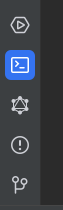
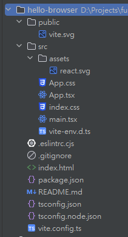
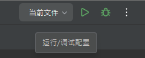
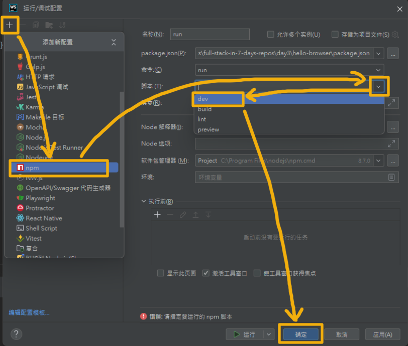
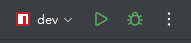
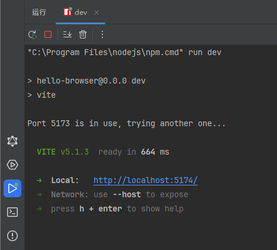
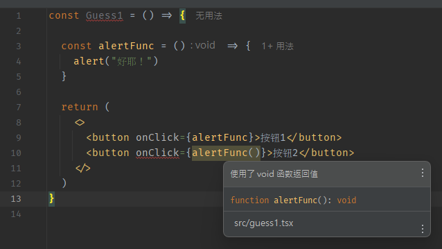
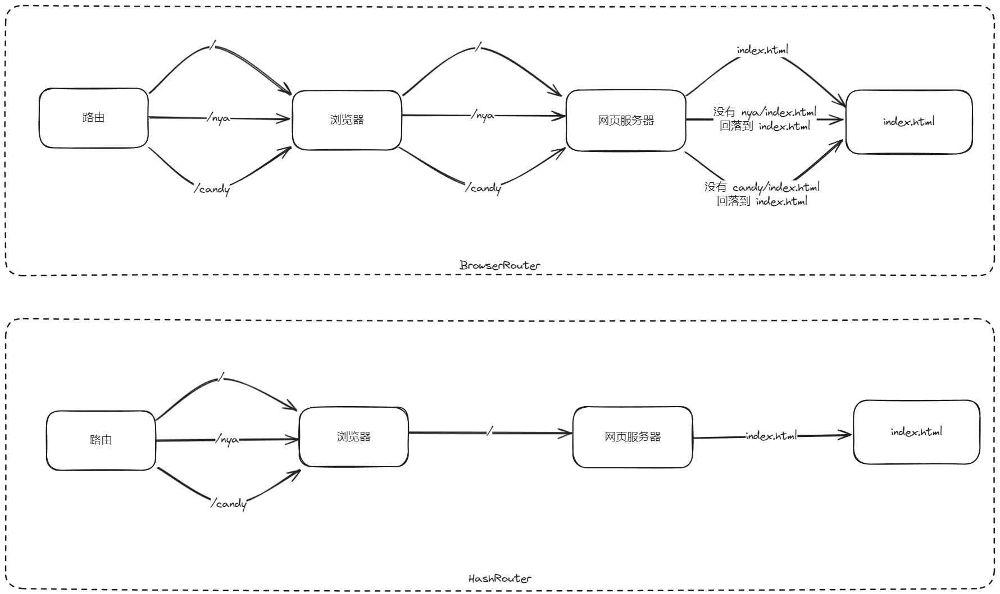

# 我的第一个前端项目：Hello browser

欢迎回来。

::: details 杂谈：项目开坑

在休息的这几天里我在想，要不要现在直接开一个完整的项目坑来开发，作为贯穿这整个文档的主线任务；但仔细考虑了之后还是打消了这个念头。开一个完整的项目需要考虑的东西太多，不是现在入门阶段能处理好的，如果毛毛躁躁没把基础打好就开始往上堆砌的话，可能会导致很多严重的问题。

所以我在想，与其压缩工期弄出一个惨不忍睹的烂尾楼，倒还不如就先静下心一步一步走，把项目的管理和设计单独弄成下一个课题来讲。等到这个课题结束的时候，您拥有了对于整个前后端流程的认知，这样的时候再按照项目管理的流程来体验一遍，或许更加合适。

:::

言归正传，今天我们要讲的是如何使用以 React 为例的现代前端工具，配合一些颇具盛名的组件库搭建出一个我们喜欢的项目。

::: tip 为什么选择了 React

没有什么特别的原因，只是我近来写 React 写得比较多所以更加熟悉而已； Vue 也同样非常好用，并且因为是国人最早开发的所以中文相关的文档资料会更加丰富一些，一些使用体验上或许也会更加贴合国内开发者的习惯。您现在看到的这个文档就是使用 [Vitepress](https://vitepress.dev/) 构建的，它的底层就是 Vue ，非常好用。

:::

## 选择工具

昨天（~~其实已经是好几天前了~~）我们提到，传统的三大件前端开发在项目管理上太过紧凑，在优化逻辑上太过松散；现代前端工具的出现就是为了解决这个问题：把组件拆散，把优化与发布逻辑聚合到一起，让每个人都能用一样的工作流来构建一个大型的项目。

我们就先来看有什么工具可以使用。

如果您看过其他 React 教程，可能里面会出现不少 [CRA (Create React App)] 这个工具。确实，这个工具是由 React 官方推出的；但因为其使用了 Webpack 作为构建内核，在性能上已经不如现在的主流构建工具来得好用；再加上它已经好久没有更新，官方都已经不再推荐使用它了（[create-react-app#13072] ）。

我个人使用得比较多的有两个，一个是 Vite ，一个是 Next.js 。 React 官方还推荐了一些[其他工具]，但我了解得不是太多。

- [Vite] 我在 CSR 就可以覆盖的场景使用
- [Next.js] 我会在需要 SSR 的场景使用

::: tip CSR 与 SSR

这里的 CSR 不是指动车， SSR 也不是指抽卡超级稀有。这两个缩写的完整展开和对应的意思分别是：

- CSR: Client Side Render ，客户端渲染
- SSR: Server Side Render ，服务端渲染

CSR 会在构建的时候把项目构建成单一的 html 文件和资源的组合，通过在客户端（浏览器）上判断路径来进行不同页面的选择渲染。对于浏览器来说，无论访问什么路径，它都只是加载了一个一模一样的 index.html ，剩下的具体页面上不同内容的渲染、和后端服务的交互等操作全部都由 JS 来实现。它的优势就是构建之后就是纯静态的资源，因此可以非常方便地托管到一些纯静态的托管平台，例如各种 Pages 上；它的劣势也很明显，因为每一个页面都是一模一样的 html 文件，因此在 head 标签里的内容也完全一致，对于不带渲染功能的搜索引擎爬虫来说就很不友好， SEO 表现也会欠佳。

SSR 则与之相反，主要的渲染工作都由服务端来完成，客户端（浏览器）加载到不同的页面上得到的内容也不一样。例如，不少非常经典的 PHP 项目使用的就是 SSR 的工作模式（新一些的用了 Laravel 的可能会使用现代前端开发方法）。这么做能显著优化 SEO ，即针对不同的页面对应生成不同的内容；并且对于客户端的渲染压力也会小一些。缺陷就是它必须运行一个服务端，因此不能部署到纯静态托管平台去。

那么，有没有一个折中的办法呢？这就是 SSG (Static Site Generation ，静态站点生成) 来实现的了。 SSG 会将独立的页面渲染成独立的 index.html ，兼具 SSR 的 SEO 友好特性和 CSR 的纯静态特性，因而非常适合于一些内容固定的场合，例如 blog ，或是像现在这个课题这种教程。对于那些需要动态地生成内容页面的场合，就还是乖乖地使用 SSR 吧。

:::

::: details SEO 是什么

Search Engine Optimization 搜索引擎优化，指通过一些技术手段，例如 meta 标签或是 OpenGraph 等，让搜索引擎更好地了解到当前站点（页面）在做些什么，从而提升当前页面的搜索精准度和排名，让用户在搜索相关的关键词时更容易访问到当前页面的机率。

这通常来说是一件好事，但如果利用了这种机制来欺骗搜索引擎，为了提升自己的排名硬是塞一些完全无关的东西进去，那就会变成内容农场那种极端案例。

:::

因此，在一些作为只给用户交互使用的工具场合，我会更喜欢使用 Vite 之类构建成纯前端的工具；在一些需要提供服务、使用 API 中间件的场合，我会使用 Next.js 。

这个课题中，我们以 Vite 为样例。

[CRA (Create React App)]: https://create-react-app.dev/
[create-react-app#13072]: https://github.com/facebook/create-react-app/issues/13072
[其他工具]: https://react.dev/learn/start-a-new-react-project#production-grade-react-frameworks
[Next.js]: https://nextjs.org/
[Vite]: https://vitejs.dev/

## Node.js 的包管理工具

- Node.js 自带一个包管理工具 **npm** ，但因为它速度较为缓慢（尤其是在国内网络环境下），并且会在项目里产生一个体积巨大的 `node_modules` 依赖目录，所以并不是非常好用。
- 您可能会在一些其他教程里看到 **yarn** 这个包管理软件，它使用了自己的镜像源，所以速度比 npm 快不少；但它也无法复用依赖项目，并且各个大版本之间的差距比较巨大，版本没对上（有些教程里使用的还是 v1 ）可能导致一些异常的情况发生，所以也不是非常推荐。
- 我自己比较常用的是 **pnpm** ，它最大的优势是能在各个项目中复用依赖，从而能较为显著地减少对于硬盘的占用。
- 另外我有听说过 **bun** ，据说非常好用，或许有机会我可以试一试。

pnpm 的安装非常简单，可以参考[官方文档](https://pnpm.io/zh/installation)中的描述。如果把握不准应该使用哪一条指令的话，可以直接使用 npm 安装：

```sh
npm install -g pnpm
```

这样安装的 pnpm 会作为 Node.js 的一个系统级别的工具，之后无论是使用还是升级都会非常方便。

当然，您也可以使用其他您喜欢的方式来安装。


::: details 运行指令

从今天开始，我们会涉及到不少需要使用指令来操作的场合。

- 每个系统上都有内置的终端用于运行指令，例如 Windows 上的 CMD 或是 PoweShell ， \*nix 上的 Terminal ；
- 不少开发工具也自己集成了一个运行指令的窗口，例如对于 VSCode 可以使用 `Ctrl` + `~` 唤起， JetBrains 系的可以点击左下角的 `终端` 按钮来打开。



如果您觉得系统自带的终端不够好看，没关系，我们还有很多替代的选择。

- 对于 Windows 用户来说，微软开发了一个非常漂亮的终端工具 [Windows Terminal] ，在支持安装应用的一般发行版上可以使用（ LTSC 不可用 :sob: ）；
- 对 macOS 用户来说，我印象里有见到别人使用 [iTerm2] 。

另外，也可以对终端本身进行一些交互优化。
- 在 Windows 上我默认使用的是 PowerShell ，具体的优化流程已经无法考证，找到了一篇或许可以参考的教程 [Add a Bash-like autocomplete to your PowerShell] ；
- 对 \*nix 系统上的 zsh ，我使用的是 [oh my zsh] 美化了一下，让它看上去更友好一些。

[Windows Terminal]: https://github.com/microsoft/terminal
[iTerm2]: https://iterm2.com/
[Add a Bash-like autocomplete to your PowerShell]: https://dev.to/ofhouse/add-a-bash-like-autocomplete-to-your-powershell-4257
[oh my zsh]: https://ohmyz.sh/

:::

## 创建一个项目

Vite 创建项目时会自动创建一个项目目录，所以我们不需要手动来创建它。

进入我们的工作区，打开一个您喜欢的终端窗口，运行这样的指令：

```sh
pnpm create vite hello-browser --template react-ts
```

其中， `hello-browser` 是我们的项目名称，而 `react-ts` 是我们使用的模板。

::: tip

Vite 还可以使用非常多其他的模板，如果您不确定具体该用哪一个的话，可以这样来交互式地创建项目：

```sh
pnpm create vite
```

:::

您会得到形如这样的输出：

```sh
../../../.pnpm-store/v3/tmp/dlx-44456    |   +1 +
../../../.pnpm-store/v3/tmp/dlx-44456    | Progress: resolved 1, reused 1, downloaded 0, added 1, done

Scaffolding project in D:\Projects\full-stack-in-7-days-repos\day3\hello-browser...

Done. Now run:

  cd hello-browser
  pnpm install
  pnpm run dev

```

这些输出的意思是已经在 `D:\Projects\full-stack-in-7-days-repos\day3\hello-browser` 这个目录下初始化了项目草稿，我们要进入项目并开始开发工作的话，只需要运行这些指令：

```sh
cd hello-browser
pnpm install
pnpm run dev
```

1. 第一条的意思是进入刚刚创建的这个目录，也就是我们的项目目录。
2. 第二条的意思是使用 pnpm 安装项目的依赖。
3. 第三条的意思是使用 pnpm 运行名称为 dev 的脚本。

我们先使用喜欢的开发工具打开这个新生成的 `hello-browser` 目录，再来依次检查这些指令。

## 基础结构

一般的开发工具都会带有一个树状结构的资源展示页面。如果您展开所有的目录，您会看到这样的一个结构：



这里的每一个目录和文件都有其独特的作用。

> - `public` 目录下的文件会在构建过程中被无变化地移动到目标目录，适合用于存放一些和代码关系不大，但在项目的最终发布中需要包含的东西，比如网页的图标，或是一些需要引用的静态资源。
> - `src` 目录下的是项目的源代码，也就是我们项目的主要核心部分。
> - `.eslintrc.cjs` 是 eslint 这个代码格式化工具的配置文件。但其实我更喜欢用 [Prettier] 。
> - `.gitignore` 文件是在使用 git 作为版本管理工具时，用于指导 git 应该忽略哪些文件不加入版本管理中。通常，我们会把一些日志、依赖、缓存和构建结果等放在这里。
> - `index.html` 是项目的主入口文件，也就是昨天我们的三大件中的 `index.html` 。但又有些不同——这个文件的 `script` 标签在构建之后会有一些变化，以及会引入构建之后的 CSS 样式。可以在这里自定义一些我们昨天提到的例如标题或是图标之类的元数据。
> - `package.json` 对于一个 Node.js 项目来说就像是心脏，它指导了整个项目的各项具体信息，包括名称、版本、类型、脚本、依赖等等，是最重要的文件之一。
> - `README.md` 通常会被认为是一个项目的说明书。它使用 [Markdown] 语法编写。
> - `tsconfig.json` 和 `tsconfig.node.json` 是 TypeScript 的配置文件。一般情况下不需要去动它，但我们可以使用一些小技巧来优化我们的路径写法。我们稍后会来处理。
> - `vite.config.ts` 是 vite 这个打包构建工具的配置文件，如果不是需要安装一些额外的插件之类的话，一般不用去动它。

[Markdown]: https://zh.wikipedia.org/wiki/Markdown
[Prettier]: https://prettier.io/

打开开发工具的指令执行终端，我们先检查一下刚刚认识的三位指令朋友。

第一条指令是对于刚创建完项目时候，在项目外面使用的；因为我们使用开发工具直接打开了项目目录，您会发现指令执行终端的路径已经是项目目录里面了，所以这条就不用执行了。

第二条指令是需要执行的。通常，在项目的依赖发生变更之后，我们会使用这条指令来根据 `package.json` 文件中的 dependencies 和 devDependencies 两项里列出的依赖进行本地同步。对于刚创建的项目来说，可以理解为依赖从无到有的变化，所以也需要一次初始同步。

::: tip

pnpm 提供了一些指令的别名（ alias ），例如 `pnpm i` 就可以起到和这条指令同样的作用：其中的 `i` 代表了 install 。

:::

执行完这条指令后，我们会看到项目目录中多出了 `node_modules` 目录和 `pnpm-lock.yaml` 文件。

- `node_modules` 目录存放的是项目的实际依赖。由于不少 Node.js 项目依赖多尔繁杂，并且包含大量的零碎文件，默认的包管理会完整复制这些依赖文件，所以这个目录有时也被称为「宇宙中最重量级的东西」。
- `pnpm-lock.yaml` 是 pnpm 安装的具体的依赖项的详细版本号。与 package.json 文件中仅仅是标注依赖名称和版本号不同，这个 lock 文件里面的内容更为精细。一般来说它的存在感不是很强，但有时由于错综复杂的依赖关系可能会导致一些奇怪的冲突问题出现，而要想让项目无论放到哪里都能正确启动，就需要利用这个文件来指定应该安装哪些具体的依赖项。

针对第三条指令的执行，因为我们每次开启项目用于调试都会用到它，所以比起直接在终端里一次次地输入，我会推荐一种更加取巧的办法：利用好开发工具的运行/调试配置管理工具。

针对 WebStorm ，它是右上角的这样一块区域：



我们可以点击「当前文件」右边的下箭头，选择 编辑配置 ，在弹出页面中创建一个新的 npm 运行指令：



::: tip 用 npm 而不是 pnpm 运行会有影响吗

就运行脚本的角度来讲，可以认为是等价而没有影响的。反正只要别用 npm 来管理依赖就好。

:::

在确定之后，我们可以看到运行/调试配置变成了现在这样：



此时点击绿色的 ▶ 按键，就可以看到 WebStorm 开始运行第三条指令了。



按下红色的 ⏹ 按键，就可以看到运行进程被结束了。

## 准备工作

### 浏览器插件

React 官方提供了一个可以用于辅助开发工作的插件 [React Developer Tools] ，它可以在各大浏览器的插件商店里找到。

这个插件会在开发者工具里添加 ⚛ Components 和 ⚛ Profiler 两个面板，前者可以用于即时查看各个组件之间的关系和其内部的状态，后者可以用来跟踪页面性能以帮助在发现奇怪性能问题时的调试工作进行。

不过在前期的开发工作中或许并不会非常多地使用到这个插件的功能，也因此如果您觉得没有必要的话可以先不安装，等之后决定要进入 React 开发领域了再补上也完全没问题。

[React Developer Tools]: https://react.dev/learn/react-developer-tools

### 优化

在正式开始写代码之前，我们先来关注一下刚刚提到的两件事：代码美化和目录优化。

Vite 初始化的项目自带一套 eslint 的配置可以开箱即用，而我更喜欢简单易用的 Prettier ，所以我会选择去掉这个 eslint ，改成 [安装 Prettier] 并 [配置 Git 钩子] 以方便在提交的时候自动格式化变化了的文件。 

有趣的是，其实并不一定需要二选一—— Prettier 也可以使用 eslint 的配置，与之友好共存。具体就看您的需要了。

[安装 Prettier]: https://prettier.io/docs/en/install.html
[配置 Git 钩子]: https://prettier.io/docs/en/install.html#git-hooks

::: tip 代码美化的意义

代码美化不会改变代码的语义，因而它无法解决运行时遇到的问题。如果代码写错了，那么无论再怎么美化都无法解决这个错误。它解决的是代码的可读性问题，即在不同的情况下，可能会由于不同的编辑器或是不同的开发者习惯导致写出来风格不同的代码；此时使用代码美化工具，可以将所有的格式都修正成美化器里规定的格式，进而确保项目的整体风格一致，并尽可能优化在未来再一次打开项目准备进一步开发时的开发体验。

:::

目录优化的意义在于有一个对 src 目录的相对路径可以稳定使用，从而避免项目过大时，目录之间相对路径关系复杂造成迷惑。

为了实现这个目标，我们需要同时让 Vite 和 TypeScript 编译器都听明白我们想做什么。

针对 Vite 来说，我们需要在 `vite.config.ts` 里放上这样的两段内容，完整的文件会看起来是这样：

```ts
import { defineConfig } from 'vite'
import react from '@vitejs/plugin-react'
import { resolve } from 'path'        // [!code ++]

// https://vitejs.dev/config/
export default defineConfig({
  plugins: [react()],
  resolve: {                          // [!code ++]
    alias: {                          // [!code ++]
      "@": resolve(__dirname, "src"), // [!code ++]
    },                                // [!code ++]
  },                                  // [!code ++]
})
```

但仅仅是这样还不行。开发工具可能会报一个错，提示找不到 `path` 模块的定义， `__dirname` 变量也是红色的未声明状态。

这是因为我们在这里使用的 path 模块是独属于 Node.js 运行环境下的内容；而 TypeScript 在初始化的时候，并没有针对 Node.js 环境进行直接的完整配置。要想解决也非常简单，手动补充相关的类型定义就可以。针对 TypeScript 下的 Node.js 环境，类型定义是 `@types/node` 。我们可以运行这样的指令来安装：

```sh
pnpm i -D @types/node
```

`-D` 的意思是将这个依赖作为开发时的依赖项进行安装。

而对于 TypeScript 编译器的提示来说倒是稍微简单一些，补充路径别名定义到 `tsconfig.json` 里面就可以，完整的文件会看起来是这样：

```json{23-27}
{
  "compilerOptions": {
    "target": "ES2020",
    "useDefineForClassFields": true,
    "lib": ["ES2020", "DOM", "DOM.Iterable"],
    "module": "ESNext",
    "skipLibCheck": true,

    /* Bundler mode */
    "moduleResolution": "bundler",
    "allowImportingTsExtensions": true,
    "resolveJsonModule": true,
    "isolatedModules": true,
    "noEmit": true,
    "jsx": "react-jsx",

    /* Linting */
    "strict": true,
    "noUnusedLocals": true,
    "noUnusedParameters": true,
    "noFallthroughCasesInSwitch": true,

    /* Path */           // [!code ++]
    "baseUrl": "./",     // [!code ++]
    "paths": {           // [!code ++]
      "@/*": ["./src/*"] // [!code ++]
    }                    // [!code ++]
  },
  "include": ["src"],
  "references": [{ "path": "./tsconfig.node.json" }]
}
```

不要忘记在第 21 行后加一个英文逗号哦。

这样设置完成之后，当我们想要调用一个例如是在 src 目录下的 example.tsx 文件时，就可以直接写成 `@/example.tsx` 这样啦。

## 开始编写代码

使用这种方法初始化的项目里自带一些代码，可以在 src 目录下找到；运行 pnpm dev 指令后，可以在终端输出的链接里直接访问到项目的预览。


::: tip 文件的后缀名

在一些场合，您可能会看到一些后缀名是 `jsx` 而不是 `tsx` 的文件。这是因为这个（些）项目使用的是 JavaScript 来编写，而不是我们在这里使用的 TypeScript 。

而 `tsx` 和 `ts` 又是两种不同的文件。 `tsx` 用于放置 React 组件，而 `ts` 里不包含组件，一般是一些辅助函数之类的。

:::

### 先从改动开始

我们先从改动 src 目录里面的内容开始学习。在没有额外说明的情况下，默认以下所有的操作都发生在 src 目录中。

例如，我们将 `Edit src/App.tsx and save to test HMR` 这句话改成 `好耶！热更新生效了` 。

这句话在 `App.tsx` 的第 25 行。我们可以直接把想要的内容写到这个 p 标签里。

``` html
<p>
  Edit <code>src/App.tsx</code> and save to test HMR <!-- [!code --] -->
  好耶！<code>热更新</code>生效了                        <!-- [!code ++] -->
</p>
```

按下保存快捷键（通常是 `Ctrl` + `S` ），我们会发现页面上的内容直接更新了。

这种更新方式一般会被称作 **热更新** ，或者说是我们替换掉的这句话里的 HMR (Hot Module Replacement ，模块热替换) 。这种技术是指在不重启构建工具和浏览器的情况下，直接实现页面上模块的替换。它有点类似 WebStorm 预览三大件项目时保存即刷新的逻辑，但它更为高级——它不依赖于某个特定的开发工具，可以在保留页面上元素状态的情况下进行替换，从而非常方便地即时查看代码对项目的影响，或是在确认复现出存在的问题之后进行快速修复。

再或者，我们让 React 的 LOGO 反向旋转。

我们会发现并没有什么 JS 代码来处理 React 的 LOGO 旋转事件。那么它是怎么实现的呢？这里就要涉及到 CSS 动画了——在昨天的课后挑战中，参考代码就使用到了这部分的技巧。

使用 CSS 动画相比 JS 渲染动画帧来说最大的好处就是使用起来更为方便，这使得它非常适合用于制作一些简单的小动画效果，例如鼠标移动到对象上时出现背景颜色变化，或是稍微放大一点的效果，或是例如 LOGO 旋转这种。 CSS 动画的另外一个好处就是可以利用硬件加速来渲染，这使得它在部分场景下能获得比 JS 动画相对更优的性能，但这并不绝对（可以参见 MDN 文档中的 [CSS 动画与 JavaScript 动画的性能](https://developer.mozilla.org/zh-CN/docs/Web/Performance/CSS_JavaScript_animation_performance) 页）。

在 `App.css` 里的第 32 行，我们可以看见 `animation: logo-spin infinite 20s linear;` 这样一行声明，作用于 `a:nth-of-type(2) .logo` 选择器。它的意思可以理解*为将一个名为 logo-spin 关键帧描述的、无限循环的、循环周期为 20 秒的、线性转换的动画，作用于同级的 a 标签中的第二个下带有 logo 类的元素*。 

那么要想让它反向旋转，我们可以将目光移向上面的 logo-spin 这个动画。它的起始角度是 0 度，结束角度是 360 度，即结束时正好回到起始位置（配合无限循环达到无缝衔接）；那么只需要让它的结束角度是 -360 度就可以反向旋转了。

```css
to {
  transform: rotate(360deg);  /* [!code --] */
  transform: rotate(-360deg); /* [!code ++] */
}
```

再或者，我们让 count 按钮被按下的时候，每次增加 2 而不是 1 。

这个改动起来就更简单了。我们看到 `App.tsx` 的第 21 行里有对按钮 button 的 onClick 封装一个函数——它看上去非常像三大件里的写法，但又有些不同。

三大件里编写函数的时候，我们需要在按钮元素的 onclick 属性上放完整的函数调用；但在 React 里写的时候，我们却只能放上函数的声明（或是像这里这种匿名函数的写法），使用函数调用会导致调用的返回值被传入，从而导致未预期的情况发生。

::: tip 猜猜1

这里是一段 React 代码。按下哪个按钮，可以弹出提示框？

```tsx
const Guess1 = () => {

  const alertFunc = () => {
    alert("好耶！");
  }

  return (
    <>
      <button onClick={alertFunc}>按钮1</button>
      <button onClick={alertFunc()}>按钮2</button>
    </>
  )
}
```
:::

所以非常简单，把 `count + 1` 改成 `count + 2` ，就可以啦。

同时这里也能通过按钮里面的文字发现， React 里构建 HTML 组件和针对内容的动态渲染设计非常简单——可以直接用花括号 `{}` 把变量包进去，在就像是函数返回值一样的写法里面写进去就可以。

至此，我们成功地将 HTML 与 JS 结合到了一起，实现了只需要 JS + CSS 就能构建起一个前端项目的简化愿景。那么，有没有办法把 CSS 也加入进来，不离开 J/TS(X) 就能实现前端开发的全家桶呢？这就是 [TailwindCSS] 能够实现的愿景了。由于使用 TailwindCSS 需要一定的前端技术基础，本次课题不会展开讨论它，如果您有兴趣的话，可以在空闲的时候开一些项目玩一玩。

[TailwindCSS]: https://tailwindcss.com/

### 新建一个组件

React 与 Vue 的一文件一组件不同，一个 TSX 文件中可以存在任意多个组件。但按照我的习惯，我会把可以复用的元素拆成独立的组件，并依照页面设计的结构进行拆分，避免单个组件太小的同时，也能避免太多组件挤在一起影响代码的可读性。

新建一个组件的工作分为两步：声明组件，导入组件，使用组件。

我们以上文的 猜猜1 为例，展示一下这三个步骤应该如何实现。

#### 声明组件

声明组件非常简单，直接复制 猜猜1 的代码，这里这种定义一个看上去像是函数的东西就可以。

如果您阅读过其他的 React 教程，可能会遇到一些使用 class 封装组件的办法，例如下面这种：

```tsx
class Greeting extends Component {
  render() {
    return <h1>Hello, {this.props.name}!</h1>;
  }
}
```

尽管这样做确实可以，但作为一种老式的实现方案，它现在已经不再被 React 官方推荐。使用新的函数式定义组件更为简洁，如果您参考的教程使用了老式的定义，请立刻警觉起来：其中的一些知识大概已经过期。

也有些资料可能会提到需要在文件顶部加入 `import React from 'react';` 这样一行导入。但 React 17 引入了一种新的 JSX 转换方案，使得它已经不再需要在每个文件单独引入（可以参见 [Introducing the New JSX Transform] 来了解更多）。

::: tip

所以只要您使用的是最新的依赖项，学习最新的技术，那么这些问题就都不存在。这也是为什么我不推荐在快速发展的技术领域去购置教材来学习的原因——科技的发展不会等出书人的反复审校，等到书出版的时候没准最新的科技已经发展到完全打破了旧有的格式了。与其花钱买过期的知识，不如静下心来去好好读一遍最新的官方文档。或者如果实在难以静下心来，想要先一写为快的话，等遇到困难了再把官方文档当字典查也行。

:::

[Introducing the New JSX Transform]: https://legacy.reactjs.org/blog/2020/09/22/introducing-the-new-jsx-transform.html

我们新建一个 `Guess1.tsx` ，复制 猜猜1 中的代码并粘贴进去。

::: details 如果您还没猜过哪个按钮能正常工作，请先想一个答案（抛个硬币也行），因为以下涉及剧透

其实在粘贴进来的时候，开发工具就会对 按钮2 给出报错信息了。



也就是说，按钮2 的定义是存在问题的。至于是什么问题，以及如果不管这个问题继续加组件会发生什么，我们会在今日总结里面来呈现。

为了避免剧透，我们去掉 按钮2 ，并把 按钮1 改成 按钮 。它现在看起来是这样的：

```tsx
const Guess1 = () => {

  const alertFunc = () => {
    alert("好耶！");
  }

  return (
    <>
      <button onClick={alertFunc}>按钮1</button>   /* [!code --] */
      <button onClick={alertFunc}>按钮</button>    /* [!code ++] */
      <button onClick={alertFunc()}>按钮2</button> /* [!code --] */
    </>
  )
}
```

:::

::: warning 首字母大写

请确保组件名的首字母是大写的，以避免和 html 自定义标签冲突可能产生的语义歧义。如果它不是大写，那么它不会被 React 认为是一个组件。

对文件名并没有什么要求。一般我会习惯对单独的组件使用大写的文件名，对不同的页面则是使用小写的文件名兼作路径。

:::

至此，这个组件的声明就已经完成。您可以自由更改这个声明，以符合您的需求。

#### 导入组件

但光是声明一个组件，没法使用它的话，就没有意义了。所以我们接下来会讲述两种不同的导入写法，和我对这两种写法的使用习惯。

第一种写法就是非常简单的在组件声明前面加入 export 来将它暴露出去。也就是这样：

```tsx
const Guess1 = () => {        /* [!code --] */
export const Guess1 = () => { /* [!code ++] */
```

通过这种方法暴露的组件，我们要使用时，可以这样来导入：

```tsx
import { Guess1 } from "@/Guess1.tsx";
```

第二种方法就更简单了，直接在组件所在的 `Guess1.tsx` 文件最底下写这样一行就可以：

```tsx
export default Guess1;
```

也就是说，针对这个文件，它默认将 `Guess1` 组件暴露出来；使用不包含花括号 {} 的默认导入时，会导入这个默认的组件。

通过这种方法暴露的组件，我们要使用时，可以这样来导入：

```tsx
import Guess1 from "@/Guess1.tsx";
```

此时，您可能已经意识到这两种传递方法的不同了。是的，使用第一种 export 方法导出的组件在一个文件中可以有无数多个，而使用第二种 export default 方法导出的组件对于每个文件最多只能有一个（可以没有）。

也因此，我会在针对组件的场合，使用第二种方式，以文件为粒度管理它们；针对一些功能辅助函数之类的东西，我会使用第一种方式，将相关联的放在同一个文件里，一来是方便管理，二来是方便使用。

#### 使用组件

当组件被导入完成之后，剩下的就是使用它们了。使用起来也非常简单，就像 HTML 写标签那样。例如，我们可以这样使用 `Guess1` 这个组件：

```tsx
<Guess1 />
```

因为我们不在这个组件里放入任何的内容，所以可以使用简略的 HTML 标签写法，直接一个标签解决。

此时的两个文件分别长这样（使用了第二种导入方式）：

::: code-group

```tsx [App.tsx]
import { useState } from 'react'
import reactLogo from './assets/react.svg'
import viteLogo from '/vite.svg'
import './App.css'
import Guess1 from "@/Guess1.tsx";  /* [!code ++] */

function App() {
  const [count, setCount] = useState(0)

  return (
    <>
      <div>
        <a href="https://vitejs.dev" target="_blank">
          
        </a>
        <a href="https://react.dev" target="_blank">
          
        </a>
      </div>
      <h1>Vite + React</h1>
      <div className="card">
        <button onClick={() => setCount((count) => count + 2)}>
          count is {count}
        </button>
        <p>
          好耶！<code>热更新</code>生效了
        </p>
      </div>
      <p className="read-the-docs">
        Click on the Vite and React logos to learn more
      </p>
      <Guess1 />                    /* [!code ++] */
    </>
  )
}

export default App
```

```tsx [Guess1.tsx]
const Guess1 = () => {

  const alertFunc = () => {
    alert("好耶！");
  }

  return (
    <>
      <button onClick={alertFunc}>按钮</button>
    </>
  )
}

export default Guess1;  /* [!code ++] */
```

:::

### 组件与目录

通常来讲，我会把组件放入一个叫做 components 的目录来管理它们，避免所有各个层级的东西都堆在一起影响体验。

针对一些一个文件写不下的大组件，我会拆进一个目录里，通过一个 `index.tsx` 将它作为整体暴露出去。通过这种拆分设计的组件，在导入时只需要写到目录层即可，不需要包含 `index.tsx` 文件，例如 `import EditServerModal from "@/components/EditServerModal";` 这样，一方面表现美观，另一方面也非常实用。

但不同的人有不同的习惯，您可以多试试不同的方案，找到自己最喜欢的那种就好。

### 更复杂的组件

如果我们的组件需要传入参数，或是需要传入内容，应该怎么做？

例如，我们现在希望 Guess1 的按钮里能显示我们想要的内容，在弹出的提示里能打印我们想要的文本。

以我的个人习惯，我会这样写：

::: code-group

```tsx [App.tsx（部分）] {10-12}
{/* ... 上略 */}

function App() {
  const [count, setCount] = useState(0)

  return (
    <>
      {/* ... 上略 */}
      </p>
      <Guess1 alertMessage={"坏耶"}>
        <h2>怪耶</h2>
      </Guess1>
    </>
  )
}

export default App

```

```tsx [Guess1.tsx（改得太多就不高亮了）]
import type { PropsWithChildren } from "react";

interface Guess1Props extends PropsWithChildren {
  alertMessage: string;
}
const Guess1 = ({ alertMessage, children }: Guess1Props) => {

  const alertFunc = () => {
    alert(alertMessage);
  }

  return (
    <>
      <button onClick={alertFunc}>
        {children}
      </button>
    </>
  )
}

export default Guess1;
```

:::

对 `App.tsx` 的改动非常好理解：展开标签，设置属性，并往里面放入内容。我们着重来看 `Guess1.tsx` 。

首先可以看到 `import type { PropsWithChildren } from "react";` 这样一行。

import 和花括号 {} 的意思我们刚刚已经理解了，那这个 type 又是什么东西呢？

这是一个 TypeScript 独有的表达，意在表述导入的这个东西是一个类型，而不是一个实际的 JavaScript 实现。通过这样导入的东西只能被 TypeScript 在类型声明中使用，不能被 JavaScript 调用用于例如构造之类的用途，在 TypeScript 编译成 JavaScript 之后就不存在了。具体可以参照 TypeScript 的文档中 [Type-only imports and exports] 部分的描述。

[Type-only imports and exports]: https://www.typescriptlang.org/docs/handbook/modules/reference.html#type-only-imports-and-exports

因此，不难猜到下面那个 `interface Guess1Props extends PropsWithChildren` 的意思，就是一个名为 Guess1Props 的 interface 扩展了 PropsWithChildren 这个类型，并在此基础上新增了一些字段。这里是一个字符串（string）类型的 alertMessage 成员。

::: details TypeScript 的 interface 与 type

TypeScript 里有两种定义类型的方法，一种是 interface ，一种是 type 。实话说就是我自己也不太明白它们之间具体的区别和联系，只是我会在一些需要组合类型的场合使用 type （运算起来方便），一些固定好作为参数接口之类的东西时候使用 interface ，其他时候把它们当作是等价的。

具体的区别可以参照 [TypeScript Examples: Types VS Interfaces] 这里在线试一试。

[TypeScript Examples: Types VS Interfaces]: https://www.typescriptlang.org/play#example/types-vs-interfaces

:::

PropsWithChildren 又是什么呢？从字面上来看，它指的是一个含有**内容**的**属性**，实际上我用它就是想表明能通过直接往这个组件内部放东西来直接给这个组件传递这个特殊的参数而已。它会给出一个 `children` 参数，可以将它放在例如 button 标签里面。

最后的疑点就只剩下 `{ alertMessage, children }: Guess1Props` 这个用法了。

根据上文的描述，不难猜出这个用法是为了提取参数以便组件使用（实际上是使用了 [解构赋值] 这样一个语法糖）。但它为什么要使用这样一种奇怪的表达，而不能像一个正常函数调用那样分别传递不同的参数呢？

[解构赋值]: https://developer.mozilla.org/zh-CN/docs/Web/JavaScript/Reference/Operators/Destructuring_assignment

~~…其实我也不知道，搜索了一下也没找到什么相关的信息。我猜是和 React 的编译转换和渲染逻辑有关， props 参数只是它的实际渲染中的某一个参数，它会再加入其他的东西。如果您找到了任何官方的资料说法，或是通过源码分析了的话，非常欢迎您在评论区提出，我们一起来交流。~~

~~无论如何， React 的组件传参虽然没有其他语言的函数调用的传参来得直接，但它依然还算优雅。我喜欢这种写法，您可以尝试发现自己喜欢的其他方案。~~

::: tip 补充来自一位友友 @tusooa 西风 的提示（[原始链接](https://kazv.moe/notice/AfFHPnunMPttM46D9E)）：

这个很显然啊，因为在用jsx的时候，你的props是无序的：

```tsx
<Comp a={1} b={2} c={3} />
<Comp b={2} c={3} a={1} />
```

如果你把component的参数做成positional的话，那它就变成有序的了

```tsx
const Comp = (a, b, c) => { ... };
```

那么我们就不知道函数参数里的a b c哪个对应JSX里的哪个了。

:::

## 使用组件库

进入现代前端开发流程的很大一个好处就是不需要自己造轮子，直接找符合自己设计风格的组件库往里面套，能省去非常多折腾基础样式和调整类型适配的工夫。缺点就是组件库里没实现的组件还得自己出手写，要么就是在选设计的时候就多看看组件库，找组件最全的那个。

React 有非常多成熟的组件库，例如经典的 [MUI] （但他们商业化了，味儿挺重），国产的 [Ant Design] （18 年圣诞节彩蛋事故那个），或是我现在工作上用了不少的 [Mantine] 。

[MUI]: https://mui.com/
[Ant Design]: https://ant.design/
[Mantine]: https://mantine.dev/

因为各家组件库用起来都大同小异，和调用自己写的组件区别不大，更多的还是要去对着各家提供的文档边看边用，所以此处就不多赘述了。

而在一些有设计方案给出，需要自建组件库的场合，我们会倾向于使用 [TailwindCSS] 来构建自定义的组件。

在课后挑战的示例代码中我们会以 Mantine 作为组件库框架，如果您有兴趣的话也可以尝试其他的。

## 更大的项目

光有一个页面并不能满足我们所有的需求。当项目的规模开始扩张的时候，我们会产生一些超出 React 和组件本身的必要处理。这里简单地讲两个非常常用的内容：路由管理和状态管理。

### 路由管理

React 本身并不带有路由管理相关的功能，这意味着它并不能用于直接处理一些需要针对不同路径渲染出不同页面的需求。我们有两种解决这个问题的方案：使用一个自带路由管理的整合框架（例如 Next.js ），或是使用一些第三方的路由管理工具（例如 react-router-dom ）。

由于我们这次并没有使用 Next.js ，因此我们以 `react-router-dom` 为例，简单介绍 React 的路由管理。

::: tip 可能过期的知识

因为这个项目也在不断地更新，此处的教程随时都有可能会过时。为了能更准确地理解相关的逻辑并解决可能出现的不兼容问题，推荐您在遇到任何疑惑时及时参考[官方的文档](https://reactrouter.com/)。

:::

首先我们需要安装它。官方文档需要我们额外安装几个其他的组件，我不确认它们是否必要，在我本地的测试里不安装这些组件也能正常工作。

::: warning 停止进程再安装

在安装依赖的时候，请记得先停止 pnpm dev 进程，因为它在运行时可能会设置一些文件锁，让安装工作遇到不必要的困难。

而且，在安装完成后，也最好重启一下进程，来加载新的包间依赖关系。

:::

```sh
pnpm i react-router-dom
```

之后就可以使用它。参照官方的样例，我们把它放置到 `main.tsx` 文件中。就像这样：

```tsx
import React from 'react'
import ReactDOM from 'react-dom/client'
import App from './App.tsx'
import './index.css'
import { createBrowserRouter, RouterProvider } from 'react-router-dom';  /* [!code ++] */

const router = createBrowserRouter([ /* [!code ++] */
  {                                  /* [!code ++] */
    path: "/",                       /* [!code ++] */
    element: <App />,                /* [!code ++] */
  },                                 /* [!code ++] */
]);                                  /* [!code ++] */

ReactDOM.createRoot(document.getElementById('root')!).render(
  <React.StrictMode>
    <App />                            /* [!code --] */
    <RouterProvider router={router} /> /* [!code ++] */
  </React.StrictMode>,
)
```

::: details 不同类型的 Router

React Router 提供三种不同类型的 Router ： BrowserRouter 、 HashRouter 和 MemoryRouter 。一般来说，前两种较为常用，而第三种至少于我个人而言是没有使用过的。所以这里只简单地讲一下前两者之间的区别。

- BrowserRouter 的意思是使用 HTTP 请求路径进行分页路由，也就是我们最常使用的方案，它美观并且便于管理。通过这种方式打开的网页，在每一个子路径下的请求会被服务器理解成不同的页面。
  
  但在使用 Vite 之类会把项目构建成仅有单一 HTML 文件的工具时，这种方式需要对部署服务器进行一些特殊的调整：需要服务器将尝试的文件配置成这个唯一的入口（也就是 index.html ）。路由是在页面加载之后由 React Router 自己来处理的，不能让网页服务器在发现请求的路径不存在于文件系统后直接扔出一个 404 。

- HashRouter 则是会将分页路径放置于浏览器地址栏的 `#` 后，作为一个浏览器加载页面时的本地状态（例如传统意义上对于各级标题的滚动定位），从而避免具体的路径被发送给网页服务器。
  
  对于网页服务器来说，它接收到的所有请求都是根目录的 index.html ，因而无需对部署服务器进行特殊配置即可正常使用；但缺陷是这种方案的路径会不美观，且非常不利于爬虫的正常获取数据——在它看来永远都只有一个属于根目录的页面。

如果这么说不好理解的话，我画了一个图：



如果还是感觉理解不能的话，没关系，我们暂时不会用到这方面的知识，等到具体部署的时候我会再详细展开来讲讲的。

:::

这样配置能让我们在加载 `/` 路径时使用 `App` 这个组件。

要加入新的路径也非常简单。例如，我们希望在访问 `/new-page` 路径时加载一个新的页面，那么我们可以这样写：

```tsx
import React from 'react'
import ReactDOM from 'react-dom/client'
import App from './App.tsx'
import './index.css'
import { createBrowserRouter, RouterProvider } from 'react-router-dom';

const router = createBrowserRouter([
  {
    path: "/",
    element: <App />,
  },
  {
    path: "/new-page",                  /* [!code ++] */
    element: <div>这是一个船新的页面</div> /* [!code ++] */
  },                                    /* [!code ++] */
]);

ReactDOM.createRoot(document.getElementById('root')!).render(
  <React.StrictMode>
    <RouterProvider router={router} />
  </React.StrictMode>,
)
```

当我们在浏览器里手动更改路径为 `/new-page` 时，页面是不是随之变化了呢～


但对用户来说，手动输入链接是不可接受的。所以让我们来设置一个按钮吧。可以在 `App.tsx` 里这样写：

```tsx
import { useState } from 'react'
import reactLogo from './assets/react.svg'
import viteLogo from '/vite.svg'
import './App.css'
import Guess1 from "@/components/Guess1.tsx";
import { NavLink } from "react-router-dom";     /* [!code ++] */

function App() {
  const [count, setCount] = useState(0)

  return (
    <>
      <div>
        <a href="https://vitejs.dev" target="_blank">
          
        </a>
        <a href="https://react.dev" target="_blank">
          
        </a>
      </div>
      <h1>Vite + React</h1>
      <div className="card">
        <button onClick={() => setCount((count) => count + 2)}>
          count is {count}
        </button>
        <p>
          好耶！<code>热更新</code>生效了
        </p>
      </div>
      <p className="read-the-docs">
        Click on the Vite and React logos to learn more
      </p>
      <Guess1 alertMessage={"坏耶"}>
        <h2>怪耶</h2>
      </Guess1>
      <NavLink to={"/new-page"}>              /* [!code ++] */
        前往异世界的大门                         /* [!code ++] */
      </NavLink>                              /* [!code ++] */
    </>
  )
}

export default App
```

页面上就会出现一行非常朴素的字。当我们点击这行字的时候，我们也就来到新的页面了。

::: tip 猜猜2

如果您打开开发者工具，您会发现这个组件渲染得到的就只是一个指定路径的 a 标签。那么，是否能用一个简单的 a 标签来替代掉这个组件呢？

:::

而如果要将各个页面组件单独拆出来，或是将页面的配置单独拆出来的方案，我想经过上面的学习，您一定已经了解了吧？那这里我就直接放出代码吧。

::: code-group

```tsx [main.tsx]
import React from 'react';
import ReactDOM from 'react-dom/client';
import './index.css';
import { RouterProvider } from 'react-router-dom';
import { router } from "@/routes.tsx";

ReactDOM.createRoot(document.getElementById('root')!).render(
  <React.StrictMode>
    <RouterProvider router={router} />
  </React.StrictMode>,
)
```

```tsx [routes.tsx]
import { createBrowserRouter } from "react-router-dom";
import App from "@/App.tsx";
import NewPage from "@/pages/new-page.tsx";

export const router = createBrowserRouter([
  {
    path: "/",
    element: <App />,
  },
  {
    path: "/new-page",
    element: <NewPage />,
  },
]);
```

```tsx [pages/new-page.tsx]
const NewPage = () => (
  <div>这是一个船新的页面</div>
);

export default NewPage;
```

:::

这些还只是 react-router-dom 的简单应用。在一个复杂项目中，通常并不是整个页面都需要更新：只有其中的一块主内容区域是和路径相关的，其他的都属于样式的部分，因而没有必要重复编写和渲染。在一些更为复杂的项目中，甚至会出现嵌套路由：即在主内容区域中又划分有共用的内容和各自路径独立的内容。这些需求，它都能实现，只是具体的配置方法各有不同。在这里由于篇幅限制暂时不展开讲解，而是会作为课后挑战的内容呈现（会给出示例代码），您可以尝试自己挑战一下阅读官方的文档尝试。

### 状态管理

React 自带一个 useState 钩子，可以在组件中管理相关的状态；对于一个不大的项目来说，可以将这个状态存储在上层，并将状态信息和状态的修改钩子通过组件传参的方式传递给下属的组件，进而串起整个项目。

但当一个项目庞大到需要存储非常多的复杂状态以控制各个模块的内容时，仅依靠 useState 来管理的状态会变得太过混乱，且子组件的权限过大容易导致一些意外的情况发生；此时使用一套优秀的状态管理系统就成了一项必备的需求。

React 有不少优秀的状态管理工具，我们以 [Redux] 为例，简单讲解一下应该如何在一个 React 项目中使用一个较为精细的状态管理系统。

[Redux]: https://redux.js.org/

Redux 默认状态下的配置工作比较复杂，不是很新手友好，所以官方提供了一个 React 绑定和 Toolkit 工具来帮助实现相关的设置。我们要使用的就是这两个工具。

::: tip 可能过期的知识

您知道我想说什么。

- [React Redux 官方文档](https://react-redux.js.org/)
- [Redux Toolkit 官方文档](https://redux-toolkit.js.org/)

:::

首先自然是安装。

```sh
pnpm i react-redux @reduxjs/toolkit
```

安装完成后，我们需要使用 redux toolkit 来创建一个项目级的存储状态的配置。我们创建一个 `store.ts` 文件，里面是这样的：

```ts
import { configureStore } from "@reduxjs/toolkit";

export const store = configureStore({
  reducer: {
  },
});

export type RootState = ReturnType<typeof store.getState>;
export type AppDispatch = typeof store.dispatch;
```

值得注意的是，最后的这两行是 TypeScript 独有的类型定义导出，用于在其他场合使用这些状态。如果您使用的是 JavaScript ，那么请去掉这两行。

::: details 什么是 reducer

当搜索这个问题的时候，我看到了各种各样的解释，但其中不少都会提到一句据传是来源于 Redux 官方文档的表达：

> It's called a reducer because it's the type of function you would pass to `Array.prototype.reduce(reducer, ?initialValue)`.

但或许是因为官方文档经历多次更新，使用了其他的表达，我并没有在官方文档里找到这一句描述。但至少它给了我们一些可能的思路：要想了解什么是 reducer ，我们先要从 JavaScript 的 `Array.prototype.reduce` 函数讲起。这个函数“[会将先前元素的计算结果作为参数传入，最后将其结果汇总为单个返回值。](https://developer.mozilla.org/zh-CN/docs/Web/JavaScript/Reference/Global_Objects/Array/reduce)”

reducer 在 Redux 里的作用很简单，它接收两个参数：当前状态和有效载荷（payload），输出一个将载荷应用到当前状态后的新状态。也因此，可以把它理解为一个 Array.prototype.reduce 里对 reducer 函数的引申义。它的功能也非常像传入进去的这个函数，即输入上一次状态与有效载荷，并输出一个新的状态。

很难找到一个合适的名称去准确地翻译这个表达，所以直接叫它 reducer 函数就好。

参考资料：
- [Redux 中的 reducer 到底是什么，以及它为什么叫 reducer？](https://www.freecodecamp.org/chinese/news/what-exactly-is-reducer-in-redux/)
- [Array.prototype.reduce() - JavaScript | MDN](https://developer.mozilla.org/zh-CN/docs/Web/JavaScript/Reference/Global_Objects/Array/reduce)

:::

在存储配置创建完成后，我们需要在 `main.tsx` 中引入它，就像这样：

```tsx
import React from 'react'
import ReactDOM from 'react-dom/client'
import App from './App.tsx'
import './index.css'
import { createBrowserRouter, RouterProvider } from 'react-router-dom';
import { store } from '@/store.ts';             /* [!code ++] */
import { Provider } from 'react-redux';         /* [!code ++] */

const router = createBrowserRouter([
  {
    path: "/",
    element: <App />,
  },
  {
    path: "/new-page",
    element: <div>这是一个船新的页面</div>
  }
]);

ReactDOM.createRoot(document.getElementById('root')!).render(
  <React.StrictMode>
    <Provider store={store}>                   /* [!code ++] */
      <RouterProvider router={router} />
    </Provider>                                /* [!code ++] */
  </React.StrictMode>,
)
```

之后，我们就可以尽情管理状态了。例如，我们把主页上按钮的 counter 状态拆出来，做成一个全局状态：

::: code-group

```tsx [slices/counterSlice.ts]
import { createSlice } from '@reduxjs/toolkit'
import type { PayloadAction } from '@reduxjs/toolkit'

export interface CounterState {
  value: number
}

const initialState: CounterState = {
  value: 0,
}

export const counterSlice = createSlice({
  name: 'counter',
  initialState,
  reducers: {
    increment: (state, action: PayloadAction<number>) => {
      state.value += action.payload
    },
  },
})

export const { increment } = counterSlice.actions

export default counterSlice.reducer
```

```tsx [store.ts]
import { configureStore } from "@reduxjs/toolkit";
import counterReducer from "@/slices/counterSlice.ts"; /* [!code ++] */

export const store = configureStore({
  reducer: {
    counter: counterReducer,                           /* [!code ++] */
  },
});

export type RootState = ReturnType<typeof store.getState>;
export type AppDispatch = typeof store.dispatch;
```

```tsx [App.tsx]
import { useState } from 'react'                          /* [!code --] */
import reactLogo from "./assets/react.svg";
import viteLogo from "/vite.svg";
import "./App.css";
import Guess1 from "@/components/Guess1.tsx";
import { NavLink } from "react-router-dom";
import { useDispatch, useSelector } from "react-redux";   /* [!code ++] */
import type { AppDispatch, RootState } from "@/store.ts"; /* [!code ++] */
import { increment } from "@/slices/counterSlice.ts";     /* [!code ++] */

function App() {
  const [count, setCount] = useState(0)                                 /* [!code --] */
  const count = useSelector((state: RootState) => state.counter.value); /* [!code ++] */
  const dispatch = useDispatch<AppDispatch>();                          /* [!code ++] */

  return (
    <>
      <div>
        <a href="https://vitejs.dev" target="_blank">
          
        </a>
        <a href="https://react.dev" target="_blank">
          
        </a>
      </div>
      <h1>Vite + React</h1>
      <div className="card">
        <button onClick={() => setCount((count) => count + 2)}> /* [!code --] */
        <button onClick={() => dispatch(increment(2))}>         /* [!code ++] */
          count is {count}
        </button>
        <p>
          好耶！<code>热更新</code>生效了
        </p>
      </div>
      <p className="read-the-docs">
        Click on the Vite and React logos to learn more
      </p>
      <Guess1 alertMessage={"坏耶"}>
        <h2>怪耶</h2>
      </Guess1>
      <NavLink to={"/new-page"}>前往异世界的大门</NavLink>
    </>
  );
}

export default App;
```

:::

那么，我们如何确定这个状态是被全局更新了呢？很简单，我们在 NewPage 组件里面也放置一个 count 状态，当改变首页的状态之后点进去看看是否变化了就可以。就像这样：

```tsx
import type { RootState } from "@/store.ts";              /* [!code ++] */
import { useSelector } from "react-redux";                /* [!code ++] */

const NewPage = () => {
  const count = useSelector((state: RootState) => state.counter.value);  /* [!code ++] */

  return (
    <div>
      这是一个船新的页面
      ，计数器现在是 {count}                                /* [!code ++] */
    </div>
  )
};

export default NewPage;
```


::: tip reducer 里的异步函数

我们暂时还没讲异步函数相关的内容，目前所有的内容都是同步处理的。我们会在之后前后端联调的时候再来讲异步函数与同步函数之间的关系和差异。

但如果您之前接触过 JavaScript ，那您一定不会对它的异步处理感到陌生。您可能会想能否往 reducer 里放置一些异步函数，例如 HTTP 请求之类的内容。

那么首先写在这里：是不能直接放的。如果要放进去的话，需要使用 [createAsyncThunk] 函数来创建一个 thunk （我也不知道这玩意应该怎么翻译），再通过 `extraReducers` 来将它引入 redux 中。

而在调用的时候，它的 dispatch 也会变成异步的，也就因此实现了对它的封装，可以用来加入一些请求结束（或失败）时的处理。

[createAsyncThunk]: https://redux-toolkit.js.org/api/createAsyncThunk

:::

## 优化

在项目变大的同时，浏览器的加载和渲染压力也会随之增加。为了避免太大的项目在性能不佳的设备上的体验太过糟糕，我们需要适时适度地进行优化。这里介绍两个我自己比较常用的优化方案：组件拆分和虚拟滚动。

组件拆分，顾名思义，就是将大组件拆成小组件的组合。这个优化主要是用来避免在小组件内部的状态更新时对整个大组件的重新渲染，导致页面闪烁或是卡顿的情况出现。我们可以根据“功能部件”或是“复用单位”为依据，将组件分别拆开。

但具体应该怎么拆，拆到什么程度是合适的，这个没有一个绝对的标准。包括我自己的习惯，也是在不断的进一步认知发展中不断变化的。您可以尝试寻找到最适合自己的那一套方案。

虚拟滚动的意思则是，对于一些非常多重复单元的组件（例如一个几万条聊天记录的聊天框），如果渲染出每一个元素，那么在渲染时就会造成非常严重的卡顿，并且在滚动操作中获得极为糟糕的体验。虚拟滚动的思想就是计算出当前滚动位置下应该加载出哪些元素（组件），而是使用高度占位符来替代那些看不到的东西。这样对于浏览器来说，实际渲染的部分就只有看到的那些组件，也就等同于仅仅渲染那几条或是几十条记录，从而有效地提升使用体验了。

优化的方法还有非常多，并且往往和开发工作是相辅相成的。在开发工作时要有优化的意识，但也需要警惕，千万不要过早优化——在发现瓶颈之前就预设一个瓶颈，很容易导致简单的代码写得太过复杂，弄不好反而会对准确性和体验造成负面的影响。

> Premature optimization is the root of all evil.

## 今日总结

今天我们快速地过了一遍 React 相关的知识，我想您应该能稍微对它是什么、能做什么、本身的局限性和对应的扩展补充都有了一定的了解。

猜猜1 的答案相信您一定能猜对——第一个按钮是有效的，第二个无效。

但如果您确实将这个组件写出来测试的话，您会发现在测试环境下，打开页面的时候就弹出了一个弹窗，并且弹出的两次。

相信您不难理解为什么会弹出弹窗——因为在尝试初始化 按钮2 这个组件的时候，使用了一个调用函数的写法，所以自然而然地调用了函数，并将函数的返回值（ void ）作为了 按钮2 的 onClick 传入参数。同时，您可能会观察到开发工具报了一个类型不匹配的错：这是因为默认没有返回的函数的返回类型是 void ，而 void 不能被 onClick 作为一个可以接受的值，也因此开发工具会认为这个类型不匹配。

那么，执行两次是什么原因呢？

参见 [My initializer or updater function runs twice] ，这是故意为之的行为。 React 在**严格模式**（Strict Mode）的**开发环境**下，会连续调用两次组件初始化来帮助发现可能存在的问题，而在生产环境下不会出现。

[My initializer or updater function runs twice]: https://react.dev/reference/react/useState#my-initializer-or-updater-function-runs-twice

猜猜2 的答案我想您也完全没问题——是有必要使用这个组件的。它虽然渲染得到的只是一个 a 标签，但它与传统意义上用于唤起浏览器的地址变换行为的 a 标签不同，它会调用 React Router 的操作，从而在不重新加载页面的情况下实现路径变换与页面组件的更新。

另外，这个组件还有一些特殊的功用，例如可以根据是否为当前页面改变自身的状态，从而辅助实现类似导航栏高亮显示活动页面的效果。

虽然对于我们目前的项目来说可能区别并不是非常大，但我还是建议使用这些内置的组件，以方便在未来项目进一步扩展到出现局部路由区域时的页面状态维护与开发工作的进行。

## 课后挑战

今天的课后挑战内容会比昨天的加上不少难度。因为我们学习了和 React 相关的很多内容，并简单讲解了一些进阶项目的技术工具。

我们需要使用 React 和组件库，设计一个至少包含这些功能的记事本：登录、管理记事（CRUD，增删改查）。

使用的组件库自选，不使用路由管理和状态管理也没问题。登录部分的逻辑可以使用账号密码，也可以使用 TOTP 。具体的逻辑先不用实现，把界面平铺开就行。如果组件库支持响应式的话，做成响应式的会更好。

预祝您开发愉快。

::: details 参考代码

请参见 https://github.com/Candinya/full-stack-in-7-days_day3-challenge

代码逻辑可能有些复杂，但应该不难理解。这只是一个参考，您不需要完全按照样例来处理。

:::
