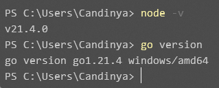
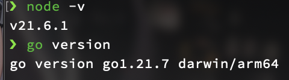
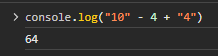
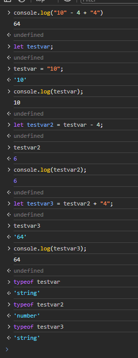

# 初探编程：这是什么，它好吃吗

:::warning

今天应该算是这个课题里**最难熬**的一天，因为今天的内容基本全是些抽象的概念，我不会放很多的图片（我会尽可能用组件把内容变得灵动一点，但因为本质上都是干巴巴的内容所以实在有点难）。如果您能坚持熬过今天，那么相信接下来的几天对您来说就都不是问题。加油。

:::


:::info

另外这里所有的内容都当作我的碎碎念随便看看就行了，千万不要折磨自己去记啦背啦什么的；并且这些也只是我的个人习惯，每个人都有每个人自己的风格，随着项目写起来很多东西自然而然就会形成最适合自己的一套方式的。

:::

## 可能您想问…

### 我可以去问大语言模型（即以对话机器人为例的交互式 AI 服务）吗

首先就来讲讲这个大家或许是最关心的问题。因为人工智能热潮和大语言模型的兴起，我经常看到有人拿代码问题去问大语言模型应该如何来实现，但得到的却是一些模棱两可的回答，或者干脆得到一段功能异常的代码。这并不好笑。

我的回答是：**可以**，但**要掌握技巧**。

大语言模型的表述能力来源于归纳总结：读书破万卷，下笔如有神。现在（截至我写这段文字时）的大语言模型并没有足够强大的神经元容量来容纳类似人类理性的抽象处理机能，在进行强化的逻辑思维能力训练和针对性的 KBQA （基于知识库的问答）处理之前，它能给出的是一些根据以往经验总结而成的看似正确的结构。但当精确到具体的项目内容里面时，大语言模型就有一些力不从心了——文档是具体的，精准的，具有时效性的；这需要的不仅是随时更新的底层数据，更需要有足够强大的逻辑思维能力将其抽象出来，而这些都是目前的大语言模型没有直接实现的。

或许有一些即时访问互联网的插件能让这些大语言模型获得近似于上述需求的能力，但一般在询问大语言模型之前，我还是更推荐 `RTFM` 和 `GIYF` 这两个不好听但好记的方法。

> * RTFM: Read the f\*cking manual - 去读文档
> * GIYF: Google is your friend - 搜索引擎是您的伙伴（题外话： Google 公司不是，它还指望着您给它送钱呢）

当有任何能**具体清晰地描述出来**（清晰的描述是理清思路的必备条件）的问题的时候，例如对使用的框架里某个功能的需求，那么我会这样来做：


1. 先去这个框架的官方文档里看看有没有相关的描述，因为一般来说官方的文档总是官方编纂的权威指南，相比起其他方法来说出错的概率会更小一些，方法也应该会更新一些；
2. 如果没有的话去搜索一下 StackOverflow 上有没有相关的问题，但要注意回答的时间是多久之前的，有没有更新的解决方案来避免一些不必要的性能损失；
3. 如果还是没有的话我会去框架的官方仓库的 issue 里看看有没有提到相关的内容，如果这是一个很普遍的需求但是官方没有实现它的话，那应该会有人提出相关的问题；
4. 如果做到这一步还是没有任何头绪的话，在 *@board* 集思广益之前，或许确实可以去找大语言模型看看能不能获得一些相关的灵感。


:::tip

当然如果您实在觉得查文档或是搜资料很累，只想一步到位解决问题的时候，我自然也不会拦着您。只要是能达到结果的办法，那么无论途径如何，我都认为是一种行之有效的方案。

对于我的编程想法来说，我不是很注重过程如何，我只注重结果是否实现了预定目标，这也就是俗称的**黑盒测试**——我看不见盒子里面具体发生了什么，但这个盒子确确实实完美地实现了我的需求。这就足够了。至于具体的优化，这又都是后话了。

:::

而当一个问题甚至都还没法被具体清晰地描述出来的时候，我则是偏向于找个人先仔细聊聊，试着开阔一下思路，寻找一些可能的分析问题的契机。在这种情况下，我当然也会觉得大语言模型也是一个非常合适的时刻情商在线~~且不会已读不回~~的忠诚伙伴了。

大语言模型还有另外一个用处，就是在写代码的时候，通过集成的工具来帮助编写注释和文档。毕竟对于把干巴巴的东西润色成流畅的自然语言这种任务来说，那正是大语言模型最擅长的呀。

### 怎样更好地搜索

我不知道为什么我要说这个话题，总之千万选择一个正常的搜索引擎，不要贪图方便去使用一些奇奇怪怪的东西。例如，我最常用的确实还是 Google （我不知道有什么其他的能代替它， DuckDuckGo 之前爆出过给微软留的后门所以我也信不过）。不要用百度，因为水一百度会开，人一百度会死（请不要忘记魏则西事件）。

另外，也不要看到搜索引擎里什么结果就直接点进去看。现在不少中文垃圾内容农场的 SEO 优化技术了得，骗过了搜索引擎的价值算法从而让完全没有价值的东西排得非常高，以至于一点进去不是垃圾广告就是付费门槛。惹不起就还是躲一躲算了。像 CSDN 这种昔日豪杰今日嚎劫已经完全烂掉了，看见就还是立刻绕过去吧。

我会喜欢使用空格分隔关键词进行搜索，而非可能有人使用的那种自然语言问询方式。使用关键词能省去冗余信息，将重点集中在关键词上，从而更方便地比照结果里的内容是否和预期的一致，并在必要的时候使用一些特殊的搜索技巧来进一步精确内容范围。

在条件允许的情况下，我会更推荐使用英文搜索，大不了在打开的页面里挂一个翻译工具辅助理解。虽然这么说可能有点难受，但目前主流的编程界确实还是一个英文为主的世界（部分特定软件除外），也因此使用英文交流能过滤掉一部分浑水摸鱼的内容，并且扩大可能的结果范围。举一个例子，我喜欢看 StackOverflow 上的回答。至于说这上面就全都是高质量内容了吗，那自然是不可能的，具体的结果还是要靠自己去努力分辨，去仔细理解。

### 我必须要用苹果电脑吗

看情况，一般如果**不是刚需的话就不用**。

不知道什么时候起感觉好像使用苹果电脑也成了程序员的一种刻板印象。从我个人的使用感受来说，苹果电脑唯二的好处是便于外勤携带和能编译苹果自己生态的项目。

便于外勤不用多说，相比起传统 X86 笔记本行业内糟糕的续航、触控板体验、未插电性能来说，苹果电脑确实占据了相对的优势；但目前 X86 阵营也有轻薄本在不断优化相关的体验，相信未来这些困难也都会被克服。只是有时候发展带来的未必都是好处，可能苹果教会这些笔记本厂家很重要的一件事就是把颗粒焊在主板上就能有效提高收益，以至于现在蛮多轻薄本已经不支持自己更换内存条，要么放弃售后找第三方换颗粒，要么从一开始就加价上高配了。

编译自己生态项目的话，其实这个是一个垄断问题。我记得所有要为苹果系生态开发软件的必须使用 Xcode 和一些包含的构建工具参与编译，而这个 Xcode 就仅在 macOS 上提供，也就等于变相锁死了开发者的设备选择：只要是想面向苹果市场，除了交开发者保护费之外，还必须配备运行 macOS 系统的设备。之前也听说过用一些奇怪的办法（例如 Hackintosh ）绕过硬件限制避开黄金内存和钻石硬盘的，但无论是出于稳定性的考量还是良心意义上的抉择，我并没有选择这种办法来解决。

我的主力开发机运行的是 Windows 系统。

* 可能有些人会问为什么不用 Linux ，因为 Linux 发行版之间的兼容性都不太一样，从而导致要做到全部兼容的开发成本相对其他平台较高，一些非面向程序开发的商业软件对 Linux 的支持都不太热情；也就导致了如果用 Linux 的话我还得专门装一台电脑来跑这些没有在 Linux 上提供的工具，这就又是徒增烦恼了。
* 性能方面的话，因为是自己组装的台式机，能直接往顶配拉，5900X 处理器 + 128 GB 内存 + 4 TB 的 SSD 做高频读写 + 18 TB 的 HDD 做海量存储 + 一张上可跑深度学习下可运行游戏的 4090 显卡，对不起目前苹果阵营里同价格级别还真没有能打的对手。


:::tip 🤣

当然如果有谁买苹果电脑只是为了一个会发光的 LOGO 坐在星巴克里能倍有感觉，以至于为了方便使用安装的还是 Windows 系统的话…那只能祝 ta 幸福了 🙏

:::

### 我应该买什么书

我也遇到过很多关于纠结于教材的情况，包括我自己以前也纠结过挑选哪些资料作为主要的参考比较好。而在经过各种新语言的尝试之后，我的建议很简单：如果您要学习的是一门非常经典非常稳定的语言（例如 C / C++ ），您可以去买相关领域的著作（ C++ Primer 或者 C++ Primer Plus ，千万别去买一个姓谭的人写的教材，那个实在是暴殄天物）；如果您要学习的是一种快速进步、日新月异的语言或是工具，那大可省下买书的钱在认认真真读完了官方文档之后去奖励自己吃一顿好的。

书籍的整理和出版需要非常长的一段时间，如果在这段时间里这门语言发生了翻天覆地的变化（例如 Vue3 相较于 Vue2 ）的话，那些精心挑选的书籍反而会成为开发路上的绊脚石。甚至是 React 这种也还算是比较稳定的语言，我都看见不少人被某些过时教程诱惑，写出了一些官方都已经不再推荐使用的 class component 用法。或是例如 webpack 这种经典工具的使用，确实能说是经典永不过时，但除了大版本更新引入的配置选项变更坑外，社区也涌现出了各种例如 rollup 之类高效好用的工具，作为与时俱进的开发者肯定是要选择这些更加现代化的方案了。

总之怎么说呢，出版书籍的人或许真的是想分享些什么，未必只是出于圈钱的目的，也因此不能因为出了被时代淘汰的东西就苛责他们；只是有些快速进步的东西实在不适合书籍这种传统的内容呈现形式，所以就还是更多地去 *RTFM* 吧。


:::tip

按照现在信息大爆发的发展速度，这份课题在不远的将来也会过时，正如所有已经被装订整齐的出版物一样，在它刚截稿的那一刻达到价值意义的巅峰。

:::

## 一些基础的概念

### 编程是什么

对我来说，编程是一种将我的想法转换成符合我需求的软件产品的一个流程。

举一个例子，前些天我需要批量重命名几百个文件到指定的格式。因为文件数量庞大，手工一个一个修改不但费时费力，还容易出现差错，所以我自然而然地会想到依赖一些程序来完成；或许也确实有一些现成的工具可以拿来直接使用，但对于并不了解相关内容的我来说，直接写一段程序来实现就非常地方便快捷。这个程序不需要很复杂，不需要考虑所有的情况，它只需要实现我此刻需要的任务——所以我会用最方便的方案来实现它。

再举一个，我想要有一个方便趁手的工具来管理一些服务器，但市面上刚好又没有完美符合我需求的解决方案的时候，我就需要直接整理整理思路开发一个。但这里并不仅仅是处理的逻辑实现——它还包括了交互界面的设计，以及后续的可维护性需求等等。交互界面的设计在许多公司的软件开发里并不属于开发者的工作范畴，但对于自己走完整个流程的个人或是团队开发者来说，我觉得拥有一定的审美和设计能力还是很有必要的。如果一个程序写出来连自己都不想去多看一眼，那么又应该如何说服别人来使用呢。


:::tip

也许您会觉得编程很像是**用乐高积木拼出来自己想要的模型**，那么恭喜您答对了。

:::

### 算法是什么

算法，简单来说就是解决问题的方法。可能有些人会把算法和算法竞赛弄混淆，认为算法是数学天才才能玩转的神仙逻辑——这就误解了。算法竞赛确实需要聪颖的头脑和强大的执行能力来实现一些苛刻甚至近乎于不可能的解决方案，但单论算法这个词来说其实这个概念没有那么复杂：做菜的菜谱可以认为是算法；拿一些不那么高级的办法实现问题的解决也是算法；哪怕只是针对结果编程，把所有的可能输入都列出来成为一张巨大的表格以便于随时从里面查询，这也是一种算法（例如密码学上常说的彩虹表）。

算法本身有*时间复杂度*和*空间复杂度*，但在这里我并不想太多讨论这个相关的话题，因为它很重要，但如果贸然给一个新人灌输这些抽象的概念很容易导致劝退。只要记住一点，如果能用更快或者更省计算资源的方法实现需求，那就当作一种更好的算法便是。在本课题讲述的内容范围内，一般用到的东西都已经有预制成的实现可以使用，不需要再像某些「大佬」说的那样把算法导论全书背诵下来才算是编程入门。

也因此，算法并不和编程直接挂钩，算法写得好的人未必就一定是业务逻辑行业的大咖。算法竞赛中为了提升效率，通常会使用极为简短的变量名来管理，并且未必会非常严谨地标注相关的注释内容；但在业务逻辑中，如果遇到了一团根本无从下手的代码的话，那比起实现的精妙度而言，或许应该更先担忧起未来的维护工作了吧。

~~（不知道反编译爱好者会不会喜欢）~~

同样令我不理解的是某些试图通过默写算法来筛选面试者的公司。在业务代码中考虑优化确实是一方面，但并不是所有的业务代码都需要对于高级算法的熟练掌握，很多时候对框架的熟悉程度会更能展现出开发者在实际开发中的业务水平，对面试者需求那么高的公司是想组建 [IOI](https://ioinformatics.org/) 战队吗？

为了增强您的信心，我在这里透露一下自己的底：我的数学很差，高等数学、线性代数和离散数学都是踩着底线过的；一些高级的排序算法从小学学到大学都没学明白，图论相关的内容更是已经完全还给老师了。但我知道在我实际写程序的时候我有互联网能访问权限，所以我只需要大概对那些相关的高级算法有一些印象，然后再在实际需要使用的时候去 *GIYF* 一下，就完全没问题了。

## 像程序一样思考

### 程序结构

在开始编写程序之前，我们先要简单地了解程序是如何工作的。在这样的情况下，我们才能实现更多地将对程序的掌控权握在我们手中，避免在遇到未知情况时候自乱阵脚。


:::tip

一个简单的原则就是：**只知道上文，不知道下文。**

:::

与事件并行发生的硬件开发不同，程序（此处特指单线程程序，本课题不会涉及人力多线程程序）中的事件依照时间顺序执行。也就是说，程序中每一行代码的执行有时间顺序：一般以进入点作为第一步，依照从上往下的顺序依次执行每一行使用到的代码。也因此，一个程序的执行顺序在其他变量都确定的情况下是可以预期的，并且所有的事件都将按照线性铺开。

因此，对于一个程序来说，它只能知道已经经历过的，不能知道未来将要经历的，~~这像极了人生~~。以输入一串数字 `114514` 为例，当程序读到 `1` 的时候，它并不能知道紧随其后的会是什么，是 14514 还是 919810 ，或是其他什么奇怪的东西。以一个不做任何限定的输入框为例，您甚至可以输入小数点！

这个原则说起来简单，做起来却很容易有时候陷入惯性思维的误区，让程序的执行出现意料之外的结果。不过完全不用担心，我们只需要在程序中插入一些能够**打印出中间值**的日志，或是利用好一个名叫**分步调试**的强大助手，按照程序的执行逻辑依次顺序地检查其中涉及到的所有内容，用来确定是在哪一步出现的异常问题就可以。我们之后会具体来讲这一块的内容。

其实本来我还想在这里展开讲一下程序的三大结构：顺序、选择、循环，但因为感觉实在有些唐突且抽象，所以就还只是简单地提一嘴——在之后讲实际实现的时候，有的是机会接触到这些内容的。

### 数据类型

另一个细节就是数据类型。这里就要提到两派程序语言：强类型和弱类型。

对于一个强类型的程序语言来说，如果您输入的是字符串（一串字符），那么即便这是一个仅包含了 0-9 字符的形如数的内容，它依然是一个字符串。对于程序而言，如果您认为它是一个数的话，那您必须使用对应的转换工具将它从字符串转换成数。请别忘记可能需要的类型检查：字符串里可以有任何字符，但一个数不能。

但弱类型的程序并没有这样的限制。类型会在必要的时候自动被转换。

* JavaScript 是一个弱类型的语言，也因此可以有一些奇怪而正确的用法（语法糖）。
* Go 则是一个强类型的语言，它的数据都需要被严格定义，并且在使用过程中不能随意转化。
* TypeScript 可以理解为是为 JavaScript 加入了类型限制，在将其编译转换成 JavaScript 之前可以理解为是一种强类型的语言；这样更方便尽早培养起来数据类型的观念，而在编译后的 JavaScript 又有足够的灵活性，可以在获取意料之外的数据的时候依然能避免出现因数据结构错误而导致程序频繁崩溃的情况出现。


:::info 猜猜1

这一串 JavaScript 代码运行会得到怎样的结果？（答案和原理会在文末揭晓）

```javascript
console.log("10" - 4 + "4")
```

:::

## 开始准备


:::tip

当您阅读到了这里，请首先为自己鼓个掌——恭喜啃完了上面那一大通干巴巴枯燥的东西。这些碎碎念内容不用刻意去记，只需要大致有点印象就可以，这样就算之后在开发工作中实际遇到了类似的问题，随时回来翻翻找找也都没问题。未来这份文档可能会搬迁至独立的稳定站点上（现在只是为了方便我整理思路用了 WYSIWYG 编辑器），到那时记得更新一下收藏的链接就可以啦。

:::

### 开发环境的准备

前端需要的主要是 Node.js ，后端需要的主要是 go ，所以分别去对应的官网遵循安装指南就可以了。

为了避免被某些搜索引擎结果里恶意的竞价排名误导，在这里给出对应的官网链接：

* Node.js: [nodejs.org](https://nodejs.org)
* go: [go.dev](https://go.dev)

如果您愿意试一试的话，可以试一试在浏览器里输入这些 URL （不明白的话暂时先理解为链接也行），一个好的 URL 应当是非常好记的，也因此能在熟悉之后背出来。

Node.js 的话我一般推荐直接装最新发行版的，当然使用 LTS 的也完全没问题。 go 的话直接用最新发行版就可以。


:::tip

但直接安装的方法有时并不方便，尤其是在需要更新时需要耗费不少的精力清理旧的环境。所以有一种方式，是使用平台对应的包管理工具（官方或第三方）来实现这些依赖环境的管理。

例如， Windows 环境可以使用 [Chocolatey](https://community.chocolatey.org/) （免费版就足够了）， macOS 环境可以使用 [homebrew](https://brew.sh/) ，各种 Linux 发行版的话就不用我再多说了吧？

:::

安装完成之后，可以这样分别打印出 Node.js 和 go 的版本号：

```bash
node -v
go version
```

会得到类似这样的输出（仅供参考，未必是最新）：

 

 

这样的话，应该就没问题了。

### 源代码的管理

我们将使用 git 来管理源代码，不使用 mercurial 或是 subversion (svn) 。

市面上有不少 git GUI 工具可用于提升操作的直观性，避开对指令的记忆工作。

* 我自己常用的是 [fork](https://fork.dev/) ，但要注意它是闭源商业软件，并且有激活数量限制（3个）。
* 以前还使用过 [Sourcetree](https://www.sourcetreeapp.com/) ，但它的响应速度比较缓慢，所以在使用了一段时间之后就没有再继续使用了。
* GitHub 有一个专门优化的 git GUI 工具 [GitHub Desktop](https://desktop.github.com/) ，以前也稍微用过几次，整体操作上挺流畅的，就是可惜对 GitHub 之外的代码托管平台的支持程度并没有特别好。
* 我还看到有人使用 [Gitnuro](https://gitnuro.com/) ，但我没有实际体验过，所以先不做评论。
* 不少开发工具也会带有自己的 git 管理工具，如果暂时没有想好用什么比较好的话，可以先从这些自带的开始尝试。

### 开发工具的选择

这一块的选择就更加见仁见智了。虽然会有人用*差生文具多*来嘲讽安装了一大堆工具但不知道如何使用的人，但我们不可忽视的是*优等生文具好*，避免在关键的场合掉链子。挑选一套趁手的开发工具非常重要，不但能提升我们开发工作时心情的愉悦程度，更能省下到处折腾的工夫来更好地致力于实际的工作中去。

* 放在以前的话，我肯定会大力推荐 [JetBrains](https://www.jetbrains.com/) 全家桶，因为它针对每一种语言专门优化的设计非常精细，仅仅是本地索引得到的代码补全功能就能完成绝大部分的操作，不需要复杂的配置就能得到非常可用的结果。但近来几个版本的性能出现了非常奇怪的问题，时不时卡死是常态，有时会出现频繁的界面闪烁让开发工作无法继续进行；强行绑定推销的 AI 功能也令人反感，更不用说使用的是 OpenAI 这个闭源商业平台提供的服务（谁知道我们的代码会被拿去做什么用），更糟心的是这个卸载不掉的 AI 功能还需要额外的付费才能使用。对我来说是已经习惯了用 WebStorm 写前端，用 GoLand 写后端；但我已经不知道是否还应该向您推荐这个平台，因为这几个版本实在是让我觉得很不舒服，不好好改 bug 而是花大量的精力去追捧 AI 热潮增收，就有点某些小而美的操作系统级即时通讯软件甚至能用来聊天一样的感觉了。
* 我另一个比较常用的工具是 [VSCode](https://code.visualstudio.com/) （注意不是那个巨大的 Visual Studio ），它相对来说更加轻量流畅，但如果需要对应平台的开发环境的话需要自己去配置，我因为用得不多所以此处就先不多赘述了。值得一提的是，因为它有一个开源的版本（微软自己发布的不是开源版本构建出来的），所以如果您对信息安全比较敏感的话，您可以使用一些使用开源版本干净编译的项目，例如 [VSCodium](https://vscodium.com/) 。
* Notepad++ 的话，从开源和性能角度来讲确实挺好用的，但默认的 UI 风格比较古早，可能会影响使用时候的体验；我支持开发者对于部分政治议题的看法，但「政见不同就搞破坏」的玩笑在我看来挺恶劣的（例如隔壁 `node-ipc` 的投毒事件），所以我不会在这里做什么评价。

至于其他的开发工具我就不是非常了解，文本编辑器的话我以前有接触过 Sublime Text 和 UltraEdit ，但因为它们是闭源的商业软件，所以都没有留下什么很深的印象，似乎是在 VSCode 出现之后就只有在一些上古教程里看到了。


:::tip

如果您决定使用 JetBrains 系的软件，可以先申请 30 天试用，在您确定趁手之后再去购买也不迟；并且如果您暂时没有将其用作商业化项目的打算，而仅仅是想用于开源项目的开发的话，您或许可以申请获取[开源开发许可证](https://www.jetbrains.com/zh-cn/community/opensource/)。

:::

另外值得一提的是，浏览器的「开发者工具」（一般按下 `F12` 按键就可以打开）里的 Console 也是一个非常不错的**浏览器级**（明天会解释） JavaScript 开发环境。遇到一些并不绑定 Node.js 环境的代码，例如上文那个 猜猜1 的时候，您可以直接将其粘贴到这里并获得结果。

### 选择一个正常的浏览器

因为我们要学的前端是以浏览器作为客户端载体的，所以我们需要选择一个正常的浏览器。

- Firefox 国际版或使用了最新 Chromium 核心的浏览器都可以；
- 不要是 Firefox 国区特供版；
- 最好避免 Safari 这个新时代的 IE （内核不错但强绑系统版本，不更新系统就只能用老内核）；
- 千万千万不要使用某些国产的缝合奇行种浏览器，要不然出了任何错误都不知道是真的错了还是单纯被政治管控了。（讲个笑话： J**aScript ）

我会使用 Chrome 作为主要演示使用的浏览器，并使用 Firefox 在必要的时候进行辅助。

### 杀毒软件

一般来说我不推荐使用杀毒软件（我自己就只用 Windows Defender ），良好的上网习惯和定期更新的系统比指望杀毒软件在出现问题时候能抢救一把要更为常用；但因为确实出现过类似 WannaCry 肆虐时期更新不及时的系统被杀毒软件抢救下来的案例，所以在这个问题上我持保留意见。

但是为了避免杀毒软件对开发工作的干扰，一般会推荐您把工作目录列入杀毒软件的白名单里面。

以及，不要随意跑网上下载下来的代码（尤其是冷门的那些），至少多看一眼它做了什么。

## 今日总结

今天的内容应该主要就是这么多了，可能未来会有一些小小的修订之类不影响大语义的改动这样。您可以先试试配置一下开发环境，再下载几个自己喜欢的工具先玩起来。如果您对这里提到的内容有任何想法或是建议，也欢迎随时来找我讨论，集思广益总是好事。

关于上文提到的`猜猜1`，答案如下，您猜对了吗？

 

为什么会得到这样的结果？外面这个用于打印结果的 `console.log` 并不会改变里面表达式的值，所以我们最后再去看它；针对里面的表达式我们可以从两个方面入手：从「弱类型」的特性考虑，从「打印出中间值」的角度加以验证。

从弱类型的角度来讲：

* 当 `"10"` 遇到 `- 4` 这个数学运算操作的时候，它被先转换成 `10` 再进行数学运算，得到的是 `6` ；
* 当 `6` 遇到 `+ "4"` 这个字符串的运算操作的时候，它被先转换成 `"6"` 再进行字符串连接运算，得到的是 `"64"` ；

但为什么它输出的是 `64` 而不是 `'64'` 呢？这就是因为 `console.log` 这个调用，它会在输出的时候打印字符串原本的内容；如果是输出一个数的话，在不同平台上的表现会不同，例如会通过输出字符的颜色来区分这些字符实际的内部类型。

怎么验证呢？我们把我们的打印中间值的想法输入到浏览器的 Console 里（每一个 `>` 表示输入并运行一段代码），看看它是否是这样处理的：

 

是不是正如您想的那样呢？
